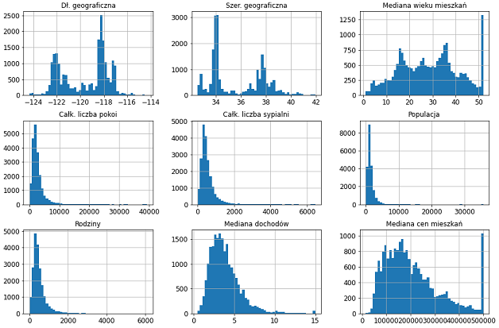
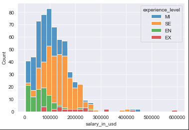
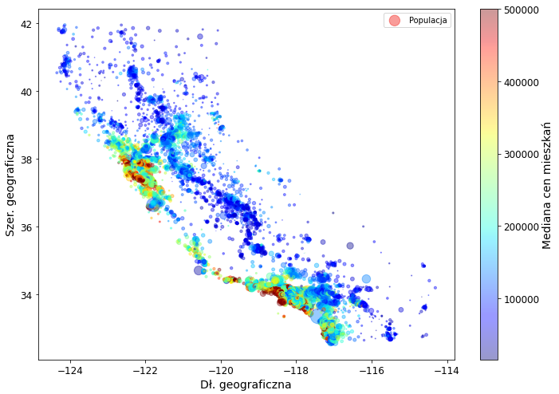
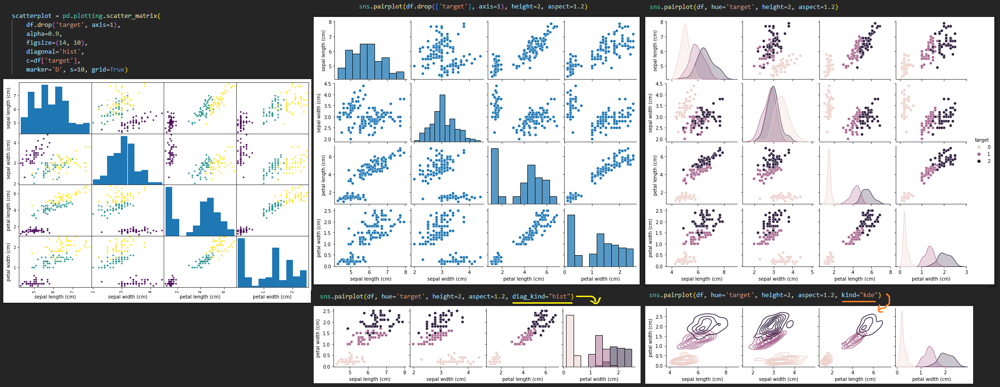
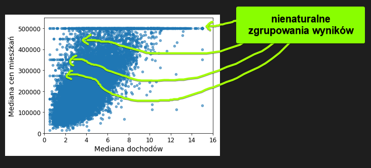

# Przebieg projektu ML
- [Ustalenie celu projektu](#ustalenie-celu-projektu)
- [Pozyskiwanie danych](#pozyskanie-danych)
- [Eksploracja danych](#eksploracja-danych)
- [Przekształcenie danych](#przekształcenie-danych)
- [Dobór modeli do przetestowania](#dobór-modeli-do-przetestowania)
- [Wybór najlepszych modeli i strojenie hiperparametrów](#wybór-najlepszych-modeli-i-strojenie-hiperparametrów)
- [Podsumowanie, analiza, łączenie modeli](#podsumowanie,-analiza,-łączenie-modeli)
- [Wdrożenie i monitorowanie rozwiązania](#Wdrożenie-i-monitorowanie-rozwiązania)

# Ustalenie celu projektu
```
To najbardziej kluczowy element projektu ML.
Dzięki niemu można już na wstępie odrzucić część projektów, których spełnienie będzie nierealne.
Można też jasno narzucić oczekiwania wobec modeli i monitorować postępy. 
Również pozwala argumentować dlaczego warto podtrzymać projekt nawet, jeżeli tymczasowo nie daje oczekiwanych rezultatów.
```

__Warto znaleźć odpowiedzi na poniższe pytania od strony biznesowej:__
1. Jaki jest cel biznesowy (co finalnie firma może zyskać na projekcie)
2. Jaki problem ma rozwiązać model (jakiej formy wyniku oczekujemy, by zrealizować cel biznesowy)
3. Czy działanie modelu bezpośrednio przekłąda się na cel biznesowy, czy ma wspierać inny proces?
4. Jakie są założenia czasowe na wdrożenie rozwiązania?
5. Jakie są założenia odnośnie budżetu?
6. Jaka jest oczekiwana dokładność lub inne parametry rozwiązania?


__Warto określić kwestie techniczne:__
1. Czy dany problem ma już jakieś istniejące rozwiązanie, które chcemy zasątpić?
2. Czy dysponujemy danymi do nauki nadzorowanej? Czy nauka będzie przyrostowa? Jak finalnie ma być użytkowany model?
3. Jak mierzymy wydajność? Czy ważniejsza jest średnia dokładność czy precyzja? Czy funkcja straty ma bardziej karać wartości odstające czy maksymalizowac dokładnośc na jak najwięjszej ilości próbek?

# Pozyskanie danych
...

# Eksploracja danych
```
Zakładam, że na tym kroku dane zostały już pozyskane i wczytane np. do formatu dataframe'u.
```
### 1. Ogólne podejrzenie zawartości:
```python
df.head() #Wyświetla 5 pierwszych wierszy z dataframe'u
```
Na tym etapie staramy się zrozumieć jak wygląda pojedyncza obserwacja, co opisują dane i czym w ogóle dysponujemy.

### 2. Podejrzenie typów danych:
```python
df.info() #Wyświetla listę kolumn, ilość uzupełnioncyh pozycji oraz typy danych
```
W tym etapie sprawdzamy, czy dane są oczekiwanych przez nas typów (Liczbowe) czy będą wymagane dodatkowe przekształcenia.

### 3. Podgląd braków
```python
# Dla każdej kolumny osobno
df.isna().sum() # Wyświetla brakujące wartości dla każdej kolumny
df.isna().mean() # Wyświetla ile % wierszy zawiera NaN'a dla każdej kolumny

# Jeżeli w którejkolwiek z kolumn (jednej lub więcej)
df.isna().any(axis=1).sum() # Wyświetla liczbę wierszy z przynajmniej 1 NaN'em
df.isna().any(axis=1).mean() # Wyświetla ile % wierszy zaweira przynajmniej jednego NaN'a

# Wyświetlanie wierszy z NaN'ami
df[df.isna().any(axis=1)] # Wyświetla wiersze w których wystąpił brak w dowolnej kolumnie
df[df['column_name'].isna()] # Wyświetla wiersze, w których brakowało danych w podanej kolumnie
```
__Tutaj warto zastanowić się nad tym dlaczego dane są nieuzupełnione.__
- Czy jest to konsekwencja tego jak zostały zbierane? Może się zdarzyć, że np. brak uzupełnienia pozycji oznacza, że zjawisko nie wystąpiło / wartośc wynosi zero a nie jest efektem braku informacji.
- Jaka duży udział mają niekomplente wiersze w całości? Czy gdyby je pominąć to nadal będziemy mieli dość danych do nauki modelu?
- Czym uzupełnić wartości w poszczególnych kolumnach o ile usunięcie ich odpada?
    - Medianą? Wartością z obserwacji najbardziej zbliżonej? Bazując na wiedzy eksperckiej?

### 4. Podgląd wartości tekstowych/kategorycznych:
```python
df['column'].value_counts() # Wyświetla wszystkie występujące wartości w danej kolumnie oraz liczbę wystąpień
df[['column1', 'column2']].value_counts() # Wyświetla liczbe wystąpień każdej kombinacji 2 kolumn
df.value_counts() # Wyświetla liczbę wystąpień kombinacji wszystkich kolumn

#Dla kazdej kolumny nie-numerycznej zlicz każdą kategorię:
text_columns = df.select_dtypes(include=['object'])
for column in text_columns:
    print(f"\n{df[column].value_counts()}")
```
__Tutaj warto zastanowić się jak możemy wykorzystać te dane__
- Czy konkretne kolumny mają kilka możliwych grup i możnaje rozbijać na kolumny "gorącojedynkowe"?
- Czy stanową pewną skalę i można je przekonwertować na uporządkowaną listę od złych-do-dobrych?
- Czy da się je zagregować do mniejszych grup żeby ograniczyć liczbe zmiennych?
- Jak rozkłada się ich liczność?

### 5. Podgląd wartości numerycznych:
```python
df.describe() # Wyświetla dla każdej numerycznej kolumny ich min, max, średnią, medianę i kwartyle
# count - liczba niezerowych wierszy
# mean - średnia
# std - σ - odhylenie standardowe - pierwiastek kwadratowy z wariancji
#   wariancja - σ^2 - średnia kwadratów odchyleń od średniej arytmetycznej
# 25%, 50%, 75% - percentyle - np. wartość dla 75% oznacza, że 75% obserwacji nie przekracza tej wartości
```
__Tutaj warto zrozumieć dane i ocenić, czy wartości są w ogóle możliwe__
- Czy nie ma znacznego rozsztrzału między medianą a średnią sugerując, że może są jakieś błędnie zerbrane obserwacje zaburzające dane?
- Czy min/max mieszczą się w przewidywanym zakresie? (Wiedza nasza lub ekspercka). Np. czy w polu WIEK nie ma osób mających kilkaset lat.
- Czy zakres danych jest zgodny z naszymi przewidywaniami? Być może ktoś dane poddał już wcześniejszej obrobce/skalowaniu i warto się dowiedzieć o tych transformacjach.

### 6. Podgląd danych na histogramach:
```python
%matplotlib inline #Dzięki tej linijce wykresy będą wyświetlane pod komórką notebookową
import matplotlib.pyplot as plt
df.hist(bins=50, figsize=(20,15)) #Liczba binsów 
```

_<p>Przykład zaczerpnięty z książki A.Gerona. [Hands-on Machine Learning with Scikit-Learn, Keras and TensorFlow](https://www.oreilly.com/library/view/hands-on-machine-learning/9781492032632/)</p>_
```python
# Na dobranie liczby binsów jest kilka sposobów, 
# - można ręcznie przetestować kilka wartości, np. 5, 20, 50
# - można wyliczyć sqrt(n)
# - można spróbować wyliczyć z reguła Scott'a jeżeli chcemy analizować czy dane mająrozkłąd normalny
#        3.5 * (standardowe odchylenie) / (liczba obserwacji) ^ (1/3). 
#        Jest to zalecana liczba binów dla normalnie rozkładających się danych.

#O większej ilości opcji można poczytać tutaj:
# https://stats.stackexchange.com/questions/798/calculating-optimal-number-of-bins-in-a-histogram

# Możemy też użyć metody np.histogram_bin_edges https://numpy.org/doc/stable/reference/generated/numpy.histogram_bin_edges.html#numpy.histogram_bin_edges

# I podać interesującą nas regułę lub pozwolić algorytmowi wybrać automatycznie:
bins = np.histogram_bin_edges(df['column_name'], bins='auto')
df['column_name'].hist(bins=bins, figsize=(10, 6))
```

```python
#Możemy też podejrzeć jakiś plot bardziej szczegółowo, albo np. nałożyć na niego kategorię
#fig, ax = plt.subplots(figsize=(14, 6)) # Jeżeli chcemy przeskalować wymiary
sns.histplot(df, x="numerical_column", hue="categorical_column", multiple="stack") #Bazowa wersja, bez żadnych modyfikacji
```


__Tutaj warto zrozumieć dane, szukać anomalii i przeanalizować ich rozkład__
- Anomalię możn wykryć np. jeżeli w jakichś punktach (zwłaszcza skrajnych) widać większe skupiska obserwacji. Może to oznaczać, że powyżej pewnej wartości dane są grupowane.
- Jeżeli chodzi o analizowanie rozkładu, najczęściej interesuje nas "czy dane mają rozkład normalny (rozkład Gaussa)" 
    - Wiedza o tym, czy dane mają rozkład normalny daje przesłanki statystyczne o tym jakich metod ML nie powinniśmy używać z tymi danymi. __Jest to podejście statystyczne często pomijaną przez DataScientistów__ - w zależności od złożoności i rozmiaru danych może być szybciej po prostu przetestować poszczególne algorytmy i sprawdzić wyniki niż analizować rozkład zmienncyh. Wiedza o tym jednak daje pewne sugestie jak można przekształcać dane dla osiągnięcia lepszych wyników.
    - możemy to oceniać "wizualnie", tj. czy mają "dzwonowaty" kształt
    - ocena wizualna jest podanta na dobór ilości binów - zmiana agregacji może sprawić, że histogram mniej bedzie przypominał dane o rozkładzie normalnym co czyni tą metodę (wizaualną) niedoskonałą
    - zamiast tego można np. przeprowadzić test shapiro-wilka i ocenić na podstawie jego wyniku

### 7. Sprawdzanie rozkładu zmiennej z testami statystycznymi
```python
from scipy.stats import shapiro

for column in df.select_dtypes(include='number').columns:
    stat, p = shapiro(df[column])
    # Test shapiro-wilka sprawdza czy zmienna jest z rozkładu normalnego
    # hipoteza zerowa - zmienna ma rozkład normalny
    # hipoteza alternatywna - zmienna nie ma rozkładu normalnego
    alpha = 0.05
if p > alpha:
    print(f"{column} - Nie możemy odrzucić hipotezy zerowej, że rozkład nie jest normalny (p-value: {p:.4f})")
else:
    print(f"{column} - Hipoteza zerowa została odrzucona, rozkład nie jest normalny (p-value: {p:.4f})")
```
```
p - prawdopodobieństwo uzyskania obserwowanego wyniku przy założeniu, że hipoteza 
zerowa jest prawdziwa.

Przykładowo mając wartość p = 0.03 dla wektora X zawierającego 1000 obserwacji, 
biorąc losowe dane z rozkładu normalnego (1000 nowych próbek) istnieje 3% szans, 
że te nowe dane wzięte z rozkładu normalnego będą statystycznie mniej przypominać 
rozkład normalny (będą miały większe odchylenia) niż wektor X który miałem pierwotnie, 
natomiast na 97% ten nowy wektor będzie się różnił mniej (Będzie bardziej podobny do 
rozkładu normalnego) niż moja próbka dla któej robiłem test

Z kolei jak P będzie miało wartość 0.9999 to na 99,99% szans wektor wylosowany będzie 
się BARDZIEJ różnił od rozkładu normalnego niż ten dla którego robiliśmy test, a więc 
prawie na pewno dane X będą miały rozkład normalny?
```
__Zastosowanie:__
- Można na podstawie rozkładu zmiennych dobierać inne metody ML
- Można użyć tego testu do zuatomatyzowanego szukania odpowiednich przekształceń dla kolumn. Np. można wszystkie kolumny poddać logarytmowaniu, potęgowaniu, pierwiastkowaniu itd. a potem ocenić rozkłady po tych przekształceniach i wybrać formę, która ma rozkład normlany do dalszej pracy z danymi.

### 8. Wizualizacja zmiennych
__Analiza wielu zmiennych na jednym wykresie__
```python
df.plot(kind="scatter", x="column1", y="coulmn2") #Wersja bazowa
df.plot(kind="scatter", x="Dł. geograficzna", y="Szer. geograficzna", alpha=0.4,
    s=df["Populacja"]/100, label="Populacja", figsize=(10,7),
    c="Mediana cen mieszkań", cmap=plt.get_cmap("jet"), colorbar=True,
    sharex=False)
# x, y = nazwy kolumn do wybrania na oś X i Y
# s - wielkość kropek - warto zauważyć, że mnożenie/dzielenie może je bardziej różnicować!
# label - czysto opisowy atrybut
# c - kolor
# cmap=plt.get_cmap(jet) - skala od niebieskiego do czerwonego
```

_<p>Przykład zaczerpnięty z książki A.Gerona. [Hands-on Machine Learning with Scikit-Learn, Keras and TensorFlow](https://www.oreilly.com/library/view/hands-on-machine-learning/9781492032632/)</p>_

__Scatter matrix - korelacje między zmiennymi__

Jeżeli zmiennych jest ograniczona ilość, możemy analizować wszystkie z nich. Jeżeli zaś będzie ich zbyt wiele, warto wyznaczyć macierz koleracji:
```python
corr_matrix = df.corr() #Wyznacza dataframe z wyliczonym współczynnikiem korelacji liniowej (Pearsona) między każdą parą zmiennych.

#"Na tej podstawie możemy szukać zmiennych, które mogą zostać później złączone w jedną, a także oceniać, które z nich są najbardziej istotne do przewidywania naszego targetu:"

corr_matrix["target"].sort_values(ascending=False) 
#Pokazuje naistotniejsze zmienne, na których warto się szczególnie skupić przy analizowaniu wykresów!

#Jeżeli w dalszych przykładach chcemy ograniczyć liczbę zmiennych możemy np. użyć:
columns = corr_matrix["target"].sort_values(ascending=False).head(5).index.tolist()
#A potem zamist wywoływać df użyj df[columns]
```
```py
# Na przedstawienie wykresów jednych zmiennych z innymi mamy kilka opcji:
scatterplot = pd.plotting.scatter_matrix(df.drop(['target'], axis=1)) #Wersja bazowa
scatterplot = pd.plotting.scatter_matrix(
    df.drop(['target'], axis=1), # jeżeli target jest kategoryczny może być warto go pominąć w plocie
    alpha=0.9,
    figsize=(14, 10), 
    diagonal='hist', 
    c=df['target'], #Zmienna kategoryczna w formacie numerycznym do kolorowania klas; może ale nie musi być częścią DF
    marker='D', s=10, grid=True)

import seaborn as sns
sns.pairplot(df.drop(['target'], axis=1)) # jeżeli target jest kategoryczny może być warto go pominąć w plocie
sns.pairplot(df, hue='target') #Jeżeli wskażemy na kolumnę będzie ona brana do kolorów i automatycznie pominięta z wykresów
# pairplot zawiera m.in parametry kind i diag_kind gdzie można określić jakie typy wykresów chcemy mieć na pozycjach (np. hist, kde, scatter)
```

__Tutaj mamy do czynienia z prawdziwą "eksploracją"__
- Nie ma jasno określonych zasad, można zerknąć na to jak się rozkładają, czy widać jakieś zależności, czy zmienne wydają skieskorelowane itd.
- Warto zwrócić uwagę, czy jakaś zmienna nie ma wyraźnie zgrupowanych wartości, które mogą sugerować, ża danie nie zostały poprawnie zebrane (być może trezba je skorygować, być może odfiltrować)


# Przekształcenie danych
...

# Dobór modeli do przetestowania
__Musimy określić, czy:__
1. Mamy dane o celu?
- Tak -> Uczenie nadzorowane (Supervised learning)
- Nie -> Uczenie nienadzorowane (unsupervised learning)

2. Czy przewidujemy liczby, kategorie jeszcze co innego?

# Wybór najlepszych modeli i strojenie hiperparametrów
...

# Podsumowanie, analiza, łączenie modeli
...

# Wdrożenie i monitorowanie rozwiązania
...
