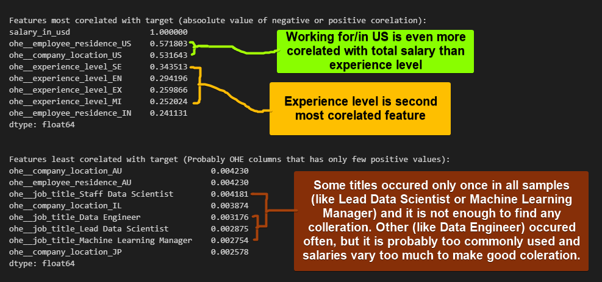

# Table of contents
NOTE: Github Notebook preview is disabling some features
To be able to use this it is required to do one of below:
- Check MD version of file [link to md version](https://github.com/SalamanderKrajza/ds-compendium/blob/main/projects/ds_salaries.md)
- Go to nbviewer: [link to this repository on nbviewer](https://nbviewer.org/github/SalamanderKrajza/ds-compendium/blob/main/projects/ds_salaries.ipynb) MAY NOT UPDATING WITH NEW COMMITS
- Clone repository and preview its content locally

### TOC:
1.  [Imports and configs](#imports-and-configs)
2.  [Load data](#load-data)
3.  [Data exploration](#data-exploration)
    -  [General informations about content](#general-informations-about-content)
    -  [Text type columns preview](#text-type-columns-preview)
    -  [Numerical columns preview](#numerical-columns-preview)
    -  [Analyze correlation and pairplots](#analyze-correlation-and-pairplots)
4.  [Data transformations](#data-transformations)
    -  [Import and define encoders](#import-and-define-encoders)
    -  [Create pipeline](#create-pipeline)
    -  [Fit pipeline and save pipeline](#fit-pipeline-and-save-pipeline)
    -  [Preview and save transformed train data](#preview-and-save-transformed-train-data)
5.  [Data exploration after transofmations](#data-exploration-after-transofmations)
    -  [Check new features corelation with target](#check-new-features-corelation-with-target)
    -  [Use PCA to visualize transformed data](#use-pca-to-visualize-transformed-data)
6.  [Prepare and transform test data for models](#prepare-and-transform-test-data-for-models)
    -  [Transform, preview and save test data](#transform,-preview-and-save-test-data)
7.  [Fit some models with default parameters](#fit-some-models-with-default-parameters)
    -  [Import and define models](#import-and-define-models)
    -  [Fit all imported models and print their errors](#fit-all-imported-models-and-print-their-errors)
8.  [Analyze deeper some best of basic models](#analyze-deeper-some-best-of-basic-models)
    -  [Analyze best model](#analyze-best-model)
        -  [Select trained model and make predictions for test data with first model](#select-trained-model-and-make-predictions-for-test-data-with-first-model)
        -  [Print targets, predictions and its differences on plots](#print-targets,-predictions-and-its-differences-on-plots)
    -  [Explore dataset and compare with predictions to get better understanding of model](#explore-dataset-and-compare-with-predictions-to-get-better-understanding-of-model)
        -  [Analyze perfectly predicted cases](#analyze-perfectly-predicted-cases)
        -  [Analyze if possible target values are repeated in different samples](#analyze-if-possible-target-values-are-repeated-in-different-samples)
        -  [Check how many duplicated rows we have to determine if it may impact results](#check-how-many-duplicated-rows-we-have-to-determine-if-it-may-impact-results)
    -  [Analyze different model](#analyze-different-model)
        -  [Select trained model and make predictions for test data with different model](#select-trained-model-and-make-predictions-for-test-data-with-different-model)
        -  [Print targets, predictions and its differences on plots for differrent model](#print-targets,-predictions-and-its-differences-on-plots-for-differrent-model)

# Imports and configs


```python
import pandas as pd
import numpy as np
import seaborn as sns
sns.set_style("darkgrid")
```

# Load data


```python
df = pd.read_csv(r'..\datasets\data\ds_salaries.csv', sep=",", index_col=0)
# https://www.kaggle.com/datasets/ruchi798/data-science-job-salaries?resource=download&select=ds_salaries.csv
df.head()
```


<div>
<style scoped>
    .dataframe tbody tr th:only-of-type {
        vertical-align: middle;
    }

    .dataframe tbody tr th {
        vertical-align: top;
    }

    .dataframe thead th {
        text-align: right;
    }
</style>
<table border="1" class="dataframe">
  <thead>
    <tr style="text-align: right;">
      <th></th>
      <th>work_year</th>
      <th>experience_level</th>
      <th>employment_type</th>
      <th>job_title</th>
      <th>salary</th>
      <th>salary_currency</th>
      <th>salary_in_usd</th>
      <th>employee_residence</th>
      <th>remote_ratio</th>
      <th>company_location</th>
      <th>company_size</th>
    </tr>
  </thead>
  <tbody>
    <tr>
      <th>0</th>
      <td>2020</td>
      <td>MI</td>
      <td>FT</td>
      <td>Data Scientist</td>
      <td>70000</td>
      <td>EUR</td>
      <td>79833</td>
      <td>DE</td>
      <td>0</td>
      <td>DE</td>
      <td>L</td>
    </tr>
    <tr>
      <th>1</th>
      <td>2020</td>
      <td>SE</td>
      <td>FT</td>
      <td>Machine Learning Scientist</td>
      <td>260000</td>
      <td>USD</td>
      <td>260000</td>
      <td>JP</td>
      <td>0</td>
      <td>JP</td>
      <td>S</td>
    </tr>
    <tr>
      <th>2</th>
      <td>2020</td>
      <td>SE</td>
      <td>FT</td>
      <td>Big Data Engineer</td>
      <td>85000</td>
      <td>GBP</td>
      <td>109024</td>
      <td>GB</td>
      <td>50</td>
      <td>GB</td>
      <td>M</td>
    </tr>
    <tr>
      <th>3</th>
      <td>2020</td>
      <td>MI</td>
      <td>FT</td>
      <td>Product Data Analyst</td>
      <td>20000</td>
      <td>USD</td>
      <td>20000</td>
      <td>HN</td>
      <td>0</td>
      <td>HN</td>
      <td>S</td>
    </tr>
    <tr>
      <th>4</th>
      <td>2020</td>
      <td>SE</td>
      <td>FT</td>
      <td>Machine Learning Engineer</td>
      <td>150000</td>
      <td>USD</td>
      <td>150000</td>
      <td>US</td>
      <td>50</td>
      <td>US</td>
      <td>L</td>
    </tr>
  </tbody>
</table>
</div>


```python
from sklearn.model_selection import train_test_split

df_train, df_test = train_test_split(df, test_size=0.2, random_state=1321)
```

# Data exploration

### General informations about content


```python
df.info()
#Widać, że większość feature'ów będzie kategoryczna a wszystkie kolumny mają jednakową ilość not-nulli
```

    <class 'pandas.core.frame.DataFrame'>
    Int64Index: 607 entries, 0 to 606
    Data columns (total 11 columns):
     #   Column              Non-Null Count  Dtype 
    ---  ------              --------------  ----- 
     0   work_year           607 non-null    int64 
     1   experience_level    607 non-null    object
     2   employment_type     607 non-null    object
     3   job_title           607 non-null    object
     4   salary              607 non-null    int64 
     5   salary_currency     607 non-null    object
     6   salary_in_usd       607 non-null    int64 
     7   employee_residence  607 non-null    object
     8   remote_ratio        607 non-null    int64 
     9   company_location    607 non-null    object
     10  company_size        607 non-null    object
    dtypes: int64(4), object(7)
    memory usage: 56.9+ KB
    


```python
df.isna().sum()
```


    work_year             0
    experience_level      0
    employment_type       0
    job_title             0
    salary                0
    salary_currency       0
    salary_in_usd         0
    employee_residence    0
    remote_ratio          0
    company_location      0
    company_size          0
    dtype: int64


### Text type columns preview


```python
text_columns = df_train.select_dtypes(include=['object'])
for column in text_columns:
    print(f"\n{df_train[column].value_counts()}")

```

    
    SE    228
    MI    173
    EN     65
    EX     19
    Name: experience_level, dtype: int64
    
    FT    471
    PT      7
    FL      4
    CT      3
    Name: employment_type, dtype: int64
    
    Data Scientist                              109
    Data Engineer                               104
    Data Analyst                                 86
    Machine Learning Engineer                    33
    Research Scientist                           14
    Data Architect                               10
    Machine Learning Scientist                    7
    Data Science Manager                          7
    Big Data Engineer                             6
    Principal Data Scientist                      6
    Applied Data Scientist                        5
    Computer Vision Engineer                      5
    Data Engineering Manager                      5
    Data Analytics Manager                        5
    Lead Data Engineer                            5
    BI Data Analyst                               5
    Data Science Consultant                       5
    Head of Data                                  5
    AI Scientist                                  5
    Director of Data Science                      4
    Business Data Analyst                         4
    ML Engineer                                   4
    Data Analytics Engineer                       3
    Principal Data Engineer                       3
    Computer Vision Software Engineer             3
    Machine Learning Infrastructure Engineer      3
    Analytics Engineer                            3
    Lead Data Analyst                             3
    Data Science Engineer                         2
    Applied Machine Learning Scientist            2
    Director of Data Engineering                  2
    Lead Data Scientist                           2
    Principal Data Analyst                        2
    Product Data Analyst                          2
    ETL Developer                                 2
    Head of Data Science                          2
    Machine Learning Developer                    2
    Financial Data Analyst                        1
    Cloud Data Engineer                           1
    Finance Data Analyst                          1
    Staff Data Scientist                          1
    Data Analytics Lead                           1
    Lead Machine Learning Engineer                1
    Big Data Architect                            1
    Machine Learning Manager                      1
    NLP Engineer                                  1
    Data Specialist                               1
    Name: job_title, dtype: int64
    
    USD    327
    EUR     74
    GBP     38
    INR     16
    CAD     13
    JPY      3
    CNY      2
    TRY      2
    BRL      2
    PLN      2
    MXN      2
    HUF      1
    AUD      1
    SGD      1
    DKK      1
    Name: salary_currency, dtype: int64
    
    US    272
    GB     39
    CA     22
    IN     18
    DE     18
    FR     15
    ES     12
    GR     10
    JP      7
    PT      5
    PK      5
    BR      5
    IT      4
    RU      4
    AE      3
    NL      3
    PL      3
    TR      2
    VN      2
    NG      2
    AT      2
    MX      2
    SI      2
    RO      2
    AU      2
    HR      1
    IE      1
    JE      1
    LU      1
    SG      1
    PR      1
    DK      1
    PH      1
    DZ      1
    CN      1
    IR      1
    HU      1
    CZ      1
    MT      1
    MD      1
    KE      1
    HN      1
    MY      1
    BG      1
    IQ      1
    EE      1
    RS      1
    NZ      1
    AR      1
    Name: employee_residence, dtype: int64
    
    US    293
    GB     40
    CA     23
    DE     19
    IN     15
    FR     13
    ES     11
    GR      9
    JP      6
    LU      3
    AT      3
    MX      3
    PL      3
    AE      3
    NL      3
    PK      3
    PT      3
    TR      2
    AU      2
    SI      2
    CN      2
    NG      2
    IT      2
    BR      2
    RU      2
    NZ      1
    EE      1
    DK      1
    MY      1
    HR      1
    VN      1
    IE      1
    IL      1
    KE      1
    CZ      1
    MT      1
    IR      1
    IQ      1
    MD      1
    HN      1
    DZ      1
    Name: company_location, dtype: int64
    
    M    264
    L    154
    S     67
    Name: company_size, dtype: int64
    


```python
text_columns_few_categories = ['experience_level', 'employment_type', 'company_size']

for column in text_columns_few_categories:
    print(f"\n{df_train[column].value_counts()}")
    
#Experience:
# EN Entry-level / Junior MI Mid-level / Intermediate SE Senior-level / Expert EX Executive-level / Director

#Employment type:
# PT Part-time FT Full-time CT Contract FL Freelance

#Company size:
# S less than 50 employees (small) M 50 to 250 employees (medium) L more than 250 employees (large)
```

    
    SE    228
    MI    173
    EN     65
    EX     19
    Name: experience_level, dtype: int64
    
    FT    471
    PT      7
    FL      4
    CT      3
    Name: employment_type, dtype: int64
    
    M    264
    L    154
    S     67
    Name: company_size, dtype: int64
    


```python
text_columns_many_categories = ['job_title', 'salary_currency', 'employee_residence', 'company_location']
for column in text_columns_many_categories:
    print(f"\n{df_train[column].value_counts().head()}")
```

    
    Data Scientist               109
    Data Engineer                104
    Data Analyst                  86
    Machine Learning Engineer     33
    Research Scientist            14
    Name: job_title, dtype: int64
    
    USD    327
    EUR     74
    GBP     38
    INR     16
    CAD     13
    Name: salary_currency, dtype: int64
    
    US    272
    GB     39
    CA     22
    IN     18
    DE     18
    Name: employee_residence, dtype: int64
    
    US    293
    GB     40
    CA     23
    DE     19
    IN     15
    Name: company_location, dtype: int64
    

### Numerical columns preview


```python
df_train.describe()
    
# Remote ratio ranges:
# 0 No remote work (less than 20%) 50 Partially remote 100 Fully remote (more than 80%)
```


<div>
<style scoped>
    .dataframe tbody tr th:only-of-type {
        vertical-align: middle;
    }

    .dataframe tbody tr th {
        vertical-align: top;
    }

    .dataframe thead th {
        text-align: right;
    }
</style>
<table border="1" class="dataframe">
  <thead>
    <tr style="text-align: right;">
      <th></th>
      <th>work_year</th>
      <th>salary</th>
      <th>salary_in_usd</th>
      <th>remote_ratio</th>
    </tr>
  </thead>
  <tbody>
    <tr>
      <th>count</th>
      <td>485.000000</td>
      <td>4.850000e+02</td>
      <td>485.000000</td>
      <td>485.000000</td>
    </tr>
    <tr>
      <th>mean</th>
      <td>2021.406186</td>
      <td>2.551077e+05</td>
      <td>114542.179381</td>
      <td>69.793814</td>
    </tr>
    <tr>
      <th>std</th>
      <td>0.702683</td>
      <td>8.753840e+05</td>
      <td>72672.826950</td>
      <td>41.659268</td>
    </tr>
    <tr>
      <th>min</th>
      <td>2020.000000</td>
      <td>4.000000e+03</td>
      <td>2859.000000</td>
      <td>0.000000</td>
    </tr>
    <tr>
      <th>25%</th>
      <td>2021.000000</td>
      <td>6.900000e+04</td>
      <td>63900.000000</td>
      <td>50.000000</td>
    </tr>
    <tr>
      <th>50%</th>
      <td>2022.000000</td>
      <td>1.129000e+05</td>
      <td>104702.000000</td>
      <td>100.000000</td>
    </tr>
    <tr>
      <th>75%</th>
      <td>2022.000000</td>
      <td>1.600800e+05</td>
      <td>150000.000000</td>
      <td>100.000000</td>
    </tr>
    <tr>
      <th>max</th>
      <td>2022.000000</td>
      <td>1.100000e+07</td>
      <td>600000.000000</td>
      <td>100.000000</td>
    </tr>
  </tbody>
</table>
</div>


```python
%matplotlib inline
import matplotlib.pyplot as plt
df_train.hist(bins=50, figsize=(14,9)) #Liczba binsów 
```


    array([[<AxesSubplot: title={'center': 'work_year'}>,
            <AxesSubplot: title={'center': 'salary'}>],
           [<AxesSubplot: title={'center': 'salary_in_usd'}>,
            <AxesSubplot: title={'center': 'remote_ratio'}>]], dtype=object)


    

    


```python
# Define the color palette for the experience levels
palette = {"EN": "blue", "MI": "green", "SE": "orange", "EX": "red"} #Pallete is optional, but i want make colors meaningfulls for myself to analyze

# Create a grid of two subplots, with the first subplot on top and the second one at the bottom
fig, axs = plt.subplots(2, 1, figsize=(14, 12))

# Plot the first histogram on the top subplot
sns.histplot(df_train, x="salary_in_usd", hue="experience_level", multiple="stack", ax=axs[0], palette=palette)

# Plot the second histogram on the bottom subplot
sns.histplot(df_train, x="salary_in_usd", hue="experience_level", multiple="dodge", ax=axs[1], palette=palette)

# Add titles to the subplots
axs[0].set_title("Stacked histogram")
axs[1].set_title("Dodged histogram")


```


    Text(0.5, 1.0, 'Dodged histogram')


    

    


### Analyze correlation and pairplots
We may want to select columns here due to 2 reasons:
- We may **dont want** to some columns with **repeated informations** (f.e. we need to drop salary when we are predicting salary_in_usd because it is same thing)
- We may to select only **most corelated** columns **if** we have **too many numerical columns** to analyze them all


```python
df_train.columns #Show all column names to determine which are wanted
```


    Index(['work_year', 'experience_level', 'employment_type', 'job_title',
           'salary', 'salary_currency', 'salary_in_usd', 'employee_residence',
           'remote_ratio', 'company_location', 'company_size'],
          dtype='object')


```python
df_train = df[['work_year', 'experience_level', 'employment_type', 'job_title',
       'salary_in_usd', 'employee_residence',
       'remote_ratio', 'company_location', 'company_size']]
```


```python
corr_matrix = df_train.corr()
corr_matrix
```


<div>
<style scoped>
    .dataframe tbody tr th:only-of-type {
        vertical-align: middle;
    }

    .dataframe tbody tr th {
        vertical-align: top;
    }

    .dataframe thead th {
        text-align: right;
    }
</style>
<table border="1" class="dataframe">
  <thead>
    <tr style="text-align: right;">
      <th></th>
      <th>work_year</th>
      <th>salary_in_usd</th>
      <th>remote_ratio</th>
    </tr>
  </thead>
  <tbody>
    <tr>
      <th>work_year</th>
      <td>1.000000</td>
      <td>0.170493</td>
      <td>0.076314</td>
    </tr>
    <tr>
      <th>salary_in_usd</th>
      <td>0.170493</td>
      <td>1.000000</td>
      <td>0.132122</td>
    </tr>
    <tr>
      <th>remote_ratio</th>
      <td>0.076314</td>
      <td>0.132122</td>
      <td>1.000000</td>
    </tr>
  </tbody>
</table>
</div>


```python
sns.pairplot(df_train, height=3, aspect=1.6, hue='company_size')
```


    <seaborn.axisgrid.PairGrid at 0x123147444f0>


    

    


```python
sns.pairplot(df_train, height=3, aspect=1.6, hue='experience_level', palette=palette,)
```


    <seaborn.axisgrid.PairGrid at 0x1231adaf3a0>


    

    


# Data transformations

### Import and define encoders


```python
from sklearn.base import BaseEstimator, TransformerMixin
from sklearn.preprocessing import StandardScaler
from sklearn.preprocessing import OneHotEncoder, MinMaxScaler

class NewColGenerator(BaseEstimator, TransformerMixin):
    def __init__(self, columns_to_generate):
        if 'employee_in_company_location' in columns_to_generate:
            self.employee_in_company_location = True
        else:
            self.employee_in_company_location = False

    def fit(self, X, y=None):
        return self

    def transform(self, X):
        if self.employee_in_company_location:
            X['employee_in_company_location'] = (X['employee_residence'] == X['company_location']).astype(int)
        return X

class OneHotEncoderForGivenColumns(BaseEstimator, TransformerMixin):  
    def __init__(self, columns_to_encode=None):
        if columns_to_encode is None:
            self.columns_to_encode = []
        else:
            self.columns_to_encode = columns_to_encode
        self.encoded_columns = None

    def fit(self, X, y=None):
        self.encoded_columns = pd.get_dummies(X, columns=self.columns_to_encode).columns
        return self

    def transform(self, X):
        X_new = pd.get_dummies(X, columns=self.columns_to_encode, dtype=int)
        return X_new.reindex(columns=self.encoded_columns, fill_value=0)

```

### Create pipeline


```python
from sklearn.compose import ColumnTransformer
from sklearn.pipeline import make_pipeline
from sklearn import set_config
set_config(transform_output = "pandas")

ct = ColumnTransformer(
    [
        # ('standardscaler', StandardScaler(), ['salary_in_usd']),
        ('minmaxscaler', MinMaxScaler(), ['work_year', 'remote_ratio']),
        ('ohe', OneHotEncoder(sparse_output=False), ['experience_level', 'employment_type', 'job_title', 'employee_residence', 'company_location', 'company_size']),
    ],
    remainder='passthrough')


preprocess_pipeline = make_pipeline(
    NewColGenerator(['employee_in_company_location']), #It wasn't workign with column_transformer so i extracted it here
    ct
)

```

### Fit pipeline and save pipeline


```python
df_train_transformed_features = df_train.drop('salary_in_usd', axis=1)
df_train_targets = df_train['salary_in_usd']
df_train_transformed_features = preprocess_pipeline.fit_transform(df_train_transformed_features)
```


```python
from joblib import dump, load
dump(preprocess_pipeline, r'..\datasets\joblibs\ds_salaries_pipe.joblib')
```


    ['..\\datasets\\joblibs\\ds_salaries_pipe.joblib']


### Preview and save transformed train data


```python
df_train_transformed = df_train_transformed_features.copy()
df_train_transformed['salary_in_usd'] = df_train_targets
df_train_transformed.head()
```


<div>
<style scoped>
    .dataframe tbody tr th:only-of-type {
        vertical-align: middle;
    }

    .dataframe tbody tr th {
        vertical-align: top;
    }

    .dataframe thead th {
        text-align: right;
    }
</style>
<table border="1" class="dataframe">
  <thead>
    <tr style="text-align: right;">
      <th></th>
      <th>minmaxscaler__work_year</th>
      <th>minmaxscaler__remote_ratio</th>
      <th>ohe__experience_level_EN</th>
      <th>ohe__experience_level_EX</th>
      <th>ohe__experience_level_MI</th>
      <th>ohe__experience_level_SE</th>
      <th>ohe__employment_type_CT</th>
      <th>ohe__employment_type_FL</th>
      <th>ohe__employment_type_FT</th>
      <th>ohe__employment_type_PT</th>
      <th>...</th>
      <th>ohe__company_location_SI</th>
      <th>ohe__company_location_TR</th>
      <th>ohe__company_location_UA</th>
      <th>ohe__company_location_US</th>
      <th>ohe__company_location_VN</th>
      <th>ohe__company_size_L</th>
      <th>ohe__company_size_M</th>
      <th>ohe__company_size_S</th>
      <th>remainder__employee_in_company_location</th>
      <th>salary_in_usd</th>
    </tr>
  </thead>
  <tbody>
    <tr>
      <th>0</th>
      <td>0.0</td>
      <td>0.0</td>
      <td>0.0</td>
      <td>0.0</td>
      <td>1.0</td>
      <td>0.0</td>
      <td>0.0</td>
      <td>0.0</td>
      <td>1.0</td>
      <td>0.0</td>
      <td>...</td>
      <td>0.0</td>
      <td>0.0</td>
      <td>0.0</td>
      <td>0.0</td>
      <td>0.0</td>
      <td>1.0</td>
      <td>0.0</td>
      <td>0.0</td>
      <td>1</td>
      <td>79833</td>
    </tr>
    <tr>
      <th>1</th>
      <td>0.0</td>
      <td>0.0</td>
      <td>0.0</td>
      <td>0.0</td>
      <td>0.0</td>
      <td>1.0</td>
      <td>0.0</td>
      <td>0.0</td>
      <td>1.0</td>
      <td>0.0</td>
      <td>...</td>
      <td>0.0</td>
      <td>0.0</td>
      <td>0.0</td>
      <td>0.0</td>
      <td>0.0</td>
      <td>0.0</td>
      <td>0.0</td>
      <td>1.0</td>
      <td>1</td>
      <td>260000</td>
    </tr>
    <tr>
      <th>2</th>
      <td>0.0</td>
      <td>0.5</td>
      <td>0.0</td>
      <td>0.0</td>
      <td>0.0</td>
      <td>1.0</td>
      <td>0.0</td>
      <td>0.0</td>
      <td>1.0</td>
      <td>0.0</td>
      <td>...</td>
      <td>0.0</td>
      <td>0.0</td>
      <td>0.0</td>
      <td>0.0</td>
      <td>0.0</td>
      <td>0.0</td>
      <td>1.0</td>
      <td>0.0</td>
      <td>1</td>
      <td>109024</td>
    </tr>
    <tr>
      <th>3</th>
      <td>0.0</td>
      <td>0.0</td>
      <td>0.0</td>
      <td>0.0</td>
      <td>1.0</td>
      <td>0.0</td>
      <td>0.0</td>
      <td>0.0</td>
      <td>1.0</td>
      <td>0.0</td>
      <td>...</td>
      <td>0.0</td>
      <td>0.0</td>
      <td>0.0</td>
      <td>0.0</td>
      <td>0.0</td>
      <td>0.0</td>
      <td>0.0</td>
      <td>1.0</td>
      <td>1</td>
      <td>20000</td>
    </tr>
    <tr>
      <th>4</th>
      <td>0.0</td>
      <td>0.5</td>
      <td>0.0</td>
      <td>0.0</td>
      <td>0.0</td>
      <td>1.0</td>
      <td>0.0</td>
      <td>0.0</td>
      <td>1.0</td>
      <td>0.0</td>
      <td>...</td>
      <td>0.0</td>
      <td>0.0</td>
      <td>0.0</td>
      <td>1.0</td>
      <td>0.0</td>
      <td>1.0</td>
      <td>0.0</td>
      <td>0.0</td>
      <td>1</td>
      <td>150000</td>
    </tr>
  </tbody>
</table>
<p>5 rows × 172 columns</p>
</div>


```python
dump(df_train_transformed, r'..\datasets\joblibs\ds_salaries_train.joblib')
```


    ['..\\datasets\\joblibs\\ds_salaries_train.joblib']


# Data exploration after transofmations

### Check new features corelation with target


```python
%%capture 
#%%Capture command pregvents cell from printing its output - I screenshoted it and commented so i dont want to have it doubled
print("Features most corelated with target (absoolute value of negative or positive corelation):")
print(abs(df_train_transformed.corr().unstack()).sort_values(ascending=False)['salary_in_usd'].head(8))

print("\n\nFeatures least corelated with target (Probably OHE columns that has only few positive values):")
print(abs(df_train_transformed.corr().unstack()).sort_values(ascending=False)['salary_in_usd'].tail(8)) ;
```




```python
print("\n\nColeration of all columns (negative correlation has valeus below zeros)")
with pd.option_context('display.max_rows', None, 'display.max_columns', None):
    print(df_train_transformed.corr().unstack().sort_values(ascending=False)['salary_in_usd'])
```

    
    
    Coleration of all columns (negative correlation has valeus below zeros)
    salary_in_usd                                              1.000000
    ohe__employee_residence_US                                 0.571803
    ohe__company_location_US                                   0.531643
    ohe__experience_level_SE                                   0.343513
    ohe__experience_level_EX                                   0.259866
    ohe__job_title_Principal Data Engineer                     0.214748
    minmaxscaler__work_year                                    0.170493
    ohe__job_title_Data Analytics Lead                         0.167707
    ohe__job_title_Principal Data Scientist                    0.156833
    remainder__employee_in_company_location                    0.151817
    minmaxscaler__remote_ratio                                 0.132122
    ohe__job_title_Financial Data Analyst                      0.131945
    ohe__job_title_Director of Data Science                    0.126107
    ohe__job_title_Data Architect                              0.125655
    ohe__employment_type_CT                                    0.092907
    ohe__job_title_Data Science Manager                        0.092202
    ohe__employment_type_FT                                    0.091819
    ohe__job_title_Applied Data Scientist                      0.081441
    ohe__job_title_Machine Learning Scientist                  0.075168
    ohe__job_title_Analytics Engineer                          0.072030
    ohe__company_size_M                                        0.069999
    ohe__company_size_L                                        0.068157
    ohe__job_title_Head of Data                                0.061527
    ohe__employee_residence_MY                                 0.050250
    ohe__job_title_Head of Data Science                        0.039542
    ohe__job_title_Lead Data Engineer                          0.038652
    ohe__company_location_RU                                   0.036657
    ohe__job_title_Director of Data Engineering                0.036039
    ohe__job_title_Applied Machine Learning Scientist          0.034200
    ohe__job_title_Data Specialist                             0.030196
    ohe__employee_residence_PR                                 0.027331
    ohe__job_title_Data Analytics Manager                      0.022603
    ohe__job_title_Data Engineering Manager                    0.014049
    ohe__job_title_Cloud Data Engineer                         0.010015
    ohe__job_title_Principal Data Analyst                      0.008274
    ohe__job_title_ML Engineer                                 0.007337
    ohe__company_location_NZ                                   0.007278
    ohe__employee_residence_NZ                                 0.007278
    ohe__employee_residence_CH                                 0.005757
    ohe__company_location_IL                                   0.003874
    ohe__job_title_Data Engineer                               0.003176
    ohe__job_title_Lead Data Scientist                         0.002875
    ohe__job_title_Machine Learning Manager                    0.002754
    ohe__company_location_JP                                   0.002578
    ohe__job_title_Staff Data Scientist                       -0.004181
    ohe__company_location_AU                                  -0.004230
    ohe__employee_residence_AU                                -0.004230
    ohe__employee_residence_SG                                -0.006586
    ohe__job_title_Computer Vision Software Engineer          -0.007007
    ohe__employee_residence_IQ                                -0.007046
    ohe__company_location_IQ                                  -0.007046
    ohe__employee_residence_JE                                -0.007046
    ohe__employee_residence_DZ                                -0.007046
    ohe__company_location_DZ                                  -0.007046
    ohe__job_title_Big Data Architect                         -0.007216
    ohe__employee_residence_RU                                -0.007522
    ohe__job_title_Research Scientist                         -0.007608
    ohe__job_title_Machine Learning Infrastructure Engineer   -0.011086
    ohe__employee_residence_AE                                -0.012225
    ohe__company_location_AE                                  -0.012225
    ohe__company_location_SG                                  -0.013180
    ohe__employee_residence_JP                                -0.013346
    ohe__job_title_Marketing Data Analyst                     -0.013547
    ohe__job_title_Lead Machine Learning Engineer             -0.013961
    ohe__employee_residence_BG                                -0.018505
    ohe__job_title_Head of Machine Learning                   -0.019056
    ohe__job_title_Lead Data Analyst                          -0.019975
    ohe__employee_residence_BO                                -0.021370
    ohe__employee_residence_BE                                -0.021571
    ohe__company_location_BE                                  -0.021571
    ohe__company_location_IE                                  -0.023408
    ohe__employee_residence_IE                                -0.023408
    ohe__employee_residence_CZ                                -0.024236
    ohe__job_title_Machine Learning Developer                 -0.026280
    ohe__employee_residence_HK                                -0.026514
    ohe__job_title_Machine Learning Engineer                  -0.028159
    ohe__job_title_Finance Data Analyst                       -0.028878
    ohe__company_location_RO                                  -0.029965
    ohe__employee_residence_AR                                -0.029965
    ohe__employee_residence_LU                                -0.030479
    ohe__job_title_Data Scientist                             -0.032182
    ohe__company_location_CN                                  -0.032951
    ohe__employee_residence_AT                                -0.035347
    ohe__job_title_Data Science Engineer                      -0.036277
    ohe__employee_residence_PH                                -0.038124
    ohe__employee_residence_HR                                -0.038205
    ohe__company_location_HR                                  -0.038205
    ohe__company_location_CH                                  -0.039075
    ohe__employee_residence_SI                                -0.039305
    ohe__company_location_SI                                  -0.039305
    ohe__employee_residence_CN                                -0.039515
    ohe__company_location_CA                                  -0.040118
    ohe__employee_residence_CL                                -0.041402
    ohe__company_location_CL                                  -0.041402
    ohe__company_location_MY                                  -0.041424
    ohe__job_title_NLP Engineer                               -0.043008
    ohe__company_location_HU                                  -0.043868
    ohe__company_location_AT                                  -0.045235
    ohe__company_location_EE                                  -0.045449
    ohe__employee_residence_EE                                -0.045449
    ohe__job_title_Business Data Analyst                      -0.045770
    ohe__employee_residence_TN                                -0.046079
    ohe__job_title_ETL Developer                              -0.046501
    ohe__employee_residence_CA                                -0.048062
    ohe__employee_residence_MT                                -0.048088
    ohe__company_location_MT                                  -0.048088
    ohe__employee_residence_RO                                -0.049370
    ohe__employee_residence_RS                                -0.049713
    ohe__company_location_CZ                                  -0.049761
    ohe__company_location_CO                                  -0.051827
    ohe__employee_residence_CO                                -0.051827
    ohe__company_location_HN                                  -0.052883
    ohe__employee_residence_HN                                -0.052883
    ohe__job_title_BI Data Analyst                            -0.052908
    ohe__company_location_PL                                  -0.053091
    ohe__company_location_AS                                  -0.053999
    ohe__employee_residence_MD                                -0.054029
    ohe__company_location_MD                                  -0.054029
    ohe__job_title_Data Analytics Engineer                    -0.054565
    ohe__company_location_UA                                  -0.056665
    ohe__employee_residence_UA                                -0.056665
    ohe__company_location_DK                                  -0.057566
    ohe__employee_residence_IT                                -0.058240
    ohe__employee_residence_KE                                -0.059030
    ohe__company_location_KE                                  -0.059030
    ohe__employee_residence_DK                                -0.060859
    ohe__job_title_3D Computer Vision Researcher              -0.061243
    ohe__company_location_IT                                  -0.061577
    ohe__employee_residence_HU                                -0.061877
    ohe__employee_residence_IR                                -0.062050
    ohe__company_location_IR                                  -0.062050
    ohe__company_location_VN                                  -0.062050
    ohe__employee_residence_PL                                -0.064469
    ohe__job_title_Data Science Consultant                    -0.065322
    ohe__company_location_NL                                  -0.065884
    ohe__employee_residence_NL                                -0.065996
    ohe__company_location_NG                                  -0.066740
    ohe__employee_residence_NG                                -0.066740
    ohe__company_location_LU                                  -0.067948
    ohe__job_title_AI Scientist                               -0.070327
    ohe__employment_type_FL                                   -0.073863
    ohe__company_location_PT                                  -0.074100
    ohe__employee_residence_MX                                -0.076322
    ohe__employee_residence_DE                                -0.078184
    ohe__company_location_MX                                  -0.079697
    ohe__job_title_Product Data Analyst                       -0.080497
    ohe__employee_residence_VN                                -0.081012
    ohe__employee_residence_BR                                -0.081264
    ohe__company_location_TR                                  -0.091652
    ohe__employee_residence_TR                                -0.091652
    ohe__company_location_BR                                  -0.093137
    ohe__company_location_DE                                  -0.094325
    ohe__job_title_Computer Vision Engineer                   -0.095660
    ohe__employee_residence_PT                                -0.097854
    ohe__job_title_Big Data Engineer                          -0.098329
    ohe__company_location_PK                                  -0.098375
    ohe__company_location_FR                                  -0.108502
    ohe__company_location_GR                                  -0.114979
    ohe__employee_residence_GR                                -0.116780
    ohe__job_title_Data Analyst                               -0.119363
    ohe__employee_residence_PK                                -0.119557
    ohe__employee_residence_GB                                -0.121820
    ohe__employee_residence_ES                                -0.122820
    ohe__company_location_GB                                  -0.125506
    ohe__company_location_ES                                  -0.128380
    ohe__employee_residence_FR                                -0.129230
    ohe__employment_type_PT                                   -0.144627
    ohe__company_size_S                                       -0.194593
    ohe__company_location_IN                                  -0.239575
    ohe__employee_residence_IN                                -0.241131
    ohe__experience_level_MI                                  -0.252024
    ohe__experience_level_EN                                  -0.294196
    dtype: float64
    

### Use PCA to visualize transformed data
```
This part is mostly for show how it could be done.
That specific dataset is not well fitted to our needs and there won't be many importand things to find out
```


```python
%%capture
# Lets start to check how well features are corelated:
corr = df_train_transformed.corr()
corr.where((abs(corr) != 1)).stack().sort_values()
```


```python
from sklearn.decomposition import PCA
pca = PCA(n_components=15) #We want to test more components to get some knowledge about how good specific nubmer of features would describe our data
pca.fit(df_train_transformed_features)
pca.explained_variance_ratio_
```


    array([0.18870155, 0.10622821, 0.07971659, 0.0617774 , 0.05637235,
           0.04705159, 0.04150098, 0.03871439, 0.02943738, 0.02383841,
           0.02219462, 0.02176459, 0.0213826 , 0.01794568, 0.01611487])


```python
(
    sum([0.18870155, 0.10622821, 0.07971659, 0.0617774 , 0.05637235,]), # With using PCA to generate 5 columns we may cover 49% of information
    sum([0.04705159, 0.04150098, 0.03871439, 0.02943738, 0.02383841,]), #Another 5 adds 18%
    sum([0.02219462, 0.02176459, 0.0213826 , 0.01794568, 0.01611487]) # Next 5 is 9% more
)
```


    (0.4927961, 0.18054275, 0.09940236)


```python
pca = PCA(n_components=5) #Lets try with 5 features
pca.fit(df_train_transformed_features)
df_reduced = pca.transform(df_train_transformed_features)
df_reduced_with_targets = df_reduced.copy()
df_reduced_with_targets['salary_in_usd'] = df_train_targets
df_reduced_with_targets
```


<div>
<style scoped>
    .dataframe tbody tr th:only-of-type {
        vertical-align: middle;
    }

    .dataframe tbody tr th {
        vertical-align: top;
    }

    .dataframe thead th {
        text-align: right;
    }
</style>
<table border="1" class="dataframe">
  <thead>
    <tr style="text-align: right;">
      <th></th>
      <th>pca0</th>
      <th>pca1</th>
      <th>pca2</th>
      <th>pca3</th>
      <th>pca4</th>
      <th>salary_in_usd</th>
    </tr>
  </thead>
  <tbody>
    <tr>
      <th>0</th>
      <td>1.552003</td>
      <td>-0.392201</td>
      <td>-0.215447</td>
      <td>-0.385461</td>
      <td>0.840186</td>
      <td>79833</td>
    </tr>
    <tr>
      <th>1</th>
      <td>0.653826</td>
      <td>-0.099623</td>
      <td>1.106906</td>
      <td>-0.055433</td>
      <td>0.010348</td>
      <td>260000</td>
    </tr>
    <tr>
      <th>2</th>
      <td>0.287006</td>
      <td>0.808606</td>
      <td>0.773674</td>
      <td>0.489873</td>
      <td>0.526217</td>
      <td>109024</td>
    </tr>
    <tr>
      <th>3</th>
      <td>1.341015</td>
      <td>0.140103</td>
      <td>-0.024762</td>
      <td>-0.335462</td>
      <td>-0.251086</td>
      <td>20000</td>
    </tr>
    <tr>
      <th>4</th>
      <td>-0.268007</td>
      <td>-1.238021</td>
      <td>0.263639</td>
      <td>0.241546</td>
      <td>0.221212</td>
      <td>150000</td>
    </tr>
    <tr>
      <th>...</th>
      <td>...</td>
      <td>...</td>
      <td>...</td>
      <td>...</td>
      <td>...</td>
      <td>...</td>
    </tr>
    <tr>
      <th>602</th>
      <td>-1.162586</td>
      <td>0.203393</td>
      <td>-0.037416</td>
      <td>0.572556</td>
      <td>-0.186192</td>
      <td>154000</td>
    </tr>
    <tr>
      <th>603</th>
      <td>-1.162586</td>
      <td>0.203393</td>
      <td>-0.037416</td>
      <td>0.572556</td>
      <td>-0.186192</td>
      <td>126000</td>
    </tr>
    <tr>
      <th>604</th>
      <td>-1.095130</td>
      <td>0.276969</td>
      <td>0.146795</td>
      <td>-0.106635</td>
      <td>0.168262</td>
      <td>129000</td>
    </tr>
    <tr>
      <th>605</th>
      <td>-1.209842</td>
      <td>0.199580</td>
      <td>0.162215</td>
      <td>-0.051885</td>
      <td>-0.186528</td>
      <td>150000</td>
    </tr>
    <tr>
      <th>606</th>
      <td>0.767080</td>
      <td>-0.579577</td>
      <td>-0.548117</td>
      <td>0.118980</td>
      <td>-0.144156</td>
      <td>200000</td>
    </tr>
  </tbody>
</table>
<p>607 rows × 6 columns</p>
</div>


```python
df_reduced_with_targets.corr()
```


<div>
<style scoped>
    .dataframe tbody tr th:only-of-type {
        vertical-align: middle;
    }

    .dataframe tbody tr th {
        vertical-align: top;
    }

    .dataframe thead th {
        text-align: right;
    }
</style>
<table border="1" class="dataframe">
  <thead>
    <tr style="text-align: right;">
      <th></th>
      <th>pca0</th>
      <th>pca1</th>
      <th>pca2</th>
      <th>pca3</th>
      <th>pca4</th>
      <th>salary_in_usd</th>
    </tr>
  </thead>
  <tbody>
    <tr>
      <th>pca0</th>
      <td>1.000000e+00</td>
      <td>-2.108882e-15</td>
      <td>4.473212e-15</td>
      <td>1.634155e-14</td>
      <td>-1.530050e-13</td>
      <td>-0.499574</td>
    </tr>
    <tr>
      <th>pca1</th>
      <td>-2.108882e-15</td>
      <td>1.000000e+00</td>
      <td>-1.550858e-13</td>
      <td>-1.431307e-12</td>
      <td>9.641097e-12</td>
      <td>-0.297337</td>
    </tr>
    <tr>
      <th>pca2</th>
      <td>4.473212e-15</td>
      <td>-1.550858e-13</td>
      <td>1.000000e+00</td>
      <td>1.202863e-12</td>
      <td>-1.433170e-11</td>
      <td>-0.112041</td>
    </tr>
    <tr>
      <th>pca3</th>
      <td>1.634155e-14</td>
      <td>-1.431307e-12</td>
      <td>1.202863e-12</td>
      <td>1.000000e+00</td>
      <td>-1.174942e-10</td>
      <td>0.051934</td>
    </tr>
    <tr>
      <th>pca4</th>
      <td>-1.530050e-13</td>
      <td>9.641097e-12</td>
      <td>-1.433170e-11</td>
      <td>-1.174942e-10</td>
      <td>1.000000e+00</td>
      <td>0.104854</td>
    </tr>
    <tr>
      <th>salary_in_usd</th>
      <td>-4.995736e-01</td>
      <td>-2.973367e-01</td>
      <td>-1.120407e-01</td>
      <td>5.193429e-02</td>
      <td>1.048537e-01</td>
      <td>1.000000</td>
    </tr>
  </tbody>
</table>
</div>


```python
sns.pairplot(df_reduced_with_targets, y_vars='salary_in_usd', x_vars=['pca0','pca1','pca2','pca3'])
```


    <seaborn.axisgrid.PairGrid at 0x1231bb0a5c0>


    

    


```python
scatterplot = sns.pairplot(df_reduced_with_targets, hue='salary_in_usd')

for ax in scatterplot.axes.flatten():
    ax.set_xlim(-2,2) #Force plots to have maximum X axis = 2 (instead of 4 for some automatic cases)
```


    

    


Preview one of above plots with more details:


```python
df_reduced_with_targets.plot(kind="scatter", x="pca4", y="pca1", alpha=0.5,
    figsize=(15,10),
    s=df_reduced_with_targets["salary_in_usd"]/1000,
    c="salary_in_usd", cmap=plt.get_cmap("jet"), colorbar=True,
    sharex=False)
```


    <AxesSubplot: xlabel='pca4', ylabel='pca1'>


    

    


All of this exploration suggests, that simple models may don't predict our data very well. <br/>
We have very limited nubmer of samples and our data has not clear patterns visible.

# Prepare and transform test data for models

### Transform, preview and save test data


```python
df_test_transformed = df_test.drop('salary_in_usd', axis=1)
df_test_targets = df_test['salary_in_usd']
df_test_transformed = preprocess_pipeline.transform(df_test_transformed)

df_test_transformed['salary_in_usd'] = df_test_targets
df_test_transformed.head()
```


<div>
<style scoped>
    .dataframe tbody tr th:only-of-type {
        vertical-align: middle;
    }

    .dataframe tbody tr th {
        vertical-align: top;
    }

    .dataframe thead th {
        text-align: right;
    }
</style>
<table border="1" class="dataframe">
  <thead>
    <tr style="text-align: right;">
      <th></th>
      <th>minmaxscaler__work_year</th>
      <th>minmaxscaler__remote_ratio</th>
      <th>ohe__experience_level_EN</th>
      <th>ohe__experience_level_EX</th>
      <th>ohe__experience_level_MI</th>
      <th>ohe__experience_level_SE</th>
      <th>ohe__employment_type_CT</th>
      <th>ohe__employment_type_FL</th>
      <th>ohe__employment_type_FT</th>
      <th>ohe__employment_type_PT</th>
      <th>...</th>
      <th>ohe__company_location_SI</th>
      <th>ohe__company_location_TR</th>
      <th>ohe__company_location_UA</th>
      <th>ohe__company_location_US</th>
      <th>ohe__company_location_VN</th>
      <th>ohe__company_size_L</th>
      <th>ohe__company_size_M</th>
      <th>ohe__company_size_S</th>
      <th>remainder__employee_in_company_location</th>
      <th>salary_in_usd</th>
    </tr>
  </thead>
  <tbody>
    <tr>
      <th>451</th>
      <td>1.0</td>
      <td>1.0</td>
      <td>0.0</td>
      <td>0.0</td>
      <td>1.0</td>
      <td>0.0</td>
      <td>0.0</td>
      <td>0.0</td>
      <td>1.0</td>
      <td>0.0</td>
      <td>...</td>
      <td>0.0</td>
      <td>0.0</td>
      <td>0.0</td>
      <td>0.0</td>
      <td>0.0</td>
      <td>0.0</td>
      <td>1.0</td>
      <td>0.0</td>
      <td>1</td>
      <td>78791</td>
    </tr>
    <tr>
      <th>423</th>
      <td>1.0</td>
      <td>0.0</td>
      <td>0.0</td>
      <td>0.0</td>
      <td>0.0</td>
      <td>1.0</td>
      <td>0.0</td>
      <td>0.0</td>
      <td>1.0</td>
      <td>0.0</td>
      <td>...</td>
      <td>0.0</td>
      <td>0.0</td>
      <td>0.0</td>
      <td>1.0</td>
      <td>0.0</td>
      <td>0.0</td>
      <td>1.0</td>
      <td>0.0</td>
      <td>1</td>
      <td>180000</td>
    </tr>
    <tr>
      <th>278</th>
      <td>0.5</td>
      <td>0.5</td>
      <td>0.0</td>
      <td>0.0</td>
      <td>0.0</td>
      <td>1.0</td>
      <td>0.0</td>
      <td>0.0</td>
      <td>1.0</td>
      <td>0.0</td>
      <td>...</td>
      <td>0.0</td>
      <td>1.0</td>
      <td>0.0</td>
      <td>0.0</td>
      <td>0.0</td>
      <td>1.0</td>
      <td>0.0</td>
      <td>0.0</td>
      <td>1</td>
      <td>20171</td>
    </tr>
    <tr>
      <th>191</th>
      <td>0.5</td>
      <td>0.5</td>
      <td>1.0</td>
      <td>0.0</td>
      <td>0.0</td>
      <td>0.0</td>
      <td>0.0</td>
      <td>0.0</td>
      <td>1.0</td>
      <td>0.0</td>
      <td>...</td>
      <td>0.0</td>
      <td>0.0</td>
      <td>0.0</td>
      <td>0.0</td>
      <td>0.0</td>
      <td>0.0</td>
      <td>1.0</td>
      <td>0.0</td>
      <td>1</td>
      <td>21844</td>
    </tr>
    <tr>
      <th>435</th>
      <td>1.0</td>
      <td>1.0</td>
      <td>0.0</td>
      <td>0.0</td>
      <td>1.0</td>
      <td>0.0</td>
      <td>0.0</td>
      <td>0.0</td>
      <td>1.0</td>
      <td>0.0</td>
      <td>...</td>
      <td>0.0</td>
      <td>0.0</td>
      <td>0.0</td>
      <td>0.0</td>
      <td>0.0</td>
      <td>0.0</td>
      <td>1.0</td>
      <td>0.0</td>
      <td>1</td>
      <td>91614</td>
    </tr>
  </tbody>
</table>
<p>5 rows × 172 columns</p>
</div>


```python
dump(df_test_transformed, r'..\datasets\joblibs\ds_salaries_test.joblib')
```


    ['..\\datasets\\joblibs\\ds_salaries_test.joblib']


# Fit some models with default parameters

### Import and define models


```python
from sklearn.metrics import mean_squared_error, mean_absolute_error
```


```python
from sklearn.linear_model import LinearRegression, BayesianRidge, Lasso, ElasticNet, Ridge
from sklearn.tree import DecisionTreeRegressor
from sklearn.ensemble import RandomForestRegressor, GradientBoostingRegressor
from sklearn.neural_network import MLPRegressor
from sklearn.linear_model import SGDRegressor
from sklearn.svm import SVR

models = {
    'LinearRegression':LinearRegression(), 
    'DecisionTreeRegressor':DecisionTreeRegressor(random_state=1321), 
    'RandomForestRegressor':RandomForestRegressor(n_estimators=100, random_state=1321), 
    'SVR':SVR(kernel="linear"), 
    'BayesianRidge': BayesianRidge(),
    'Lasso': Lasso(max_iter=50000),
    'ElasticNet': ElasticNet(),
    'Ridge': Ridge(),
    'GradientBoostingRegressor': GradientBoostingRegressor(random_state=1321),
    'SGDRegressor': SGDRegressor(random_state=1321),
    'SVR_rbf': SVR(kernel="rbf"),
    'ExampleNeuralNetwork_with_100_relu_activations': MLPRegressor(random_state=1321, max_iter=10000),
}
```

### Fit all imported models and print their errors


```python
for name, model in models.items():

    print(f"{name:22s}:", end="\t")
    model.fit(df_train_transformed.drop('salary_in_usd', axis=1), df_train_transformed['salary_in_usd'])
    
    #Training data:
    y_pred = model.predict(df_train_transformed.drop('salary_in_usd', axis=1))
    mse = mean_squared_error(df_train_transformed['salary_in_usd'], y_pred)
    rmse = np.sqrt(mse)
    mae = mean_absolute_error(df_train_transformed['salary_in_usd'], y_pred)
    print(f"TRAIN - RMSE: {rmse:.4f};  MAE:{mae:.4f}", end="")

    #Test data
    y_pred = model.predict(df_test_transformed.drop('salary_in_usd', axis=1))
    mse = mean_squared_error(df_test_transformed['salary_in_usd'], y_pred)
    rmse = np.sqrt(mse)
    mae = mean_absolute_error(df_test_transformed['salary_in_usd'], y_pred)
    print(f" | TEST - RMSE: {rmse:.4f}; MAE:{mae:.4f}")
```

    LinearRegression      :	TRAIN - RMSE: 38909.9936;  MAE:25986.1839 | TEST - RMSE: 33256.2373; MAE:22763.4344
    DecisionTreeRegressor :	TRAIN - RMSE: 23526.9128;  MAE:12513.5611 | TEST - RMSE: 20936.7875; MAE:10380.0873
    RandomForestRegressor :	TRAIN - RMSE: 28533.5656;  MAE:18957.4162 | TEST - RMSE: 24127.5997; MAE:16649.8831
    SVR                   :	TRAIN - RMSE: 71601.7154;  MAE:51812.7768 | TEST - RMSE: 62750.7466; MAE:49643.4201
    BayesianRidge         :	TRAIN - RMSE: 43260.9331;  MAE:29243.8257 | TEST - RMSE: 33021.4306; MAE:25701.7510
    Lasso                 :	TRAIN - RMSE: 38911.4315;  MAE:26031.6356 | TEST - RMSE: 33234.6155; MAE:22840.6979
    ElasticNet            :	TRAIN - RMSE: 58113.2329;  MAE:39696.6991 | TEST - RMSE: 46769.8407; MAE:37152.4608
    Ridge                 :	TRAIN - RMSE: 40993.0241;  MAE:27902.8399 | TEST - RMSE: 32672.8492; MAE:24379.7046
    GradientBoostingRegressor:	TRAIN - RMSE: 36829.9175;  MAE:26698.9251 | TEST - RMSE: 30259.3339; MAE:23789.5111
    SGDRegressor          :	TRAIN - RMSE: 44492.4414;  MAE:29999.3777 | TEST - RMSE: 33792.3700; MAE:26352.4566
    SVR_rbf               :	TRAIN - RMSE: 71694.9308;  MAE:51968.8980 | TEST - RMSE: 62915.2314; MAE:49846.7624
    ExampleNeuralNetwork_with_100_relu_activations:	TRAIN - RMSE: 48232.5726;  MAE:31035.1979 | TEST - RMSE: 34403.8567; MAE:26372.8792
    

    c:\Users\salamander\AppData\Local\Programs\Python\Python310\lib\site-packages\sklearn\neural_network\_multilayer_perceptron.py:686: ConvergenceWarning: Stochastic Optimizer: Maximum iterations (10000) reached and the optimization hasn't converged yet.
      warnings.warn(
    

The best models above are DecisionTreeRegressor and RandomForestRegressor
```
MODEL                           RMSE       MAE          RANK_RMSE   RANK_MAE 
'DecisionTreeRegressor':    (20936.7875,10380.0873),        1,          1
'RandomForestRegressor':    (24127.5997,16649.8831),        2,          2
'GradientBoostingRegresson':(30259.3339,23789.5111),        3,          5
'Ridge':                    (32672.8492,24379.7046),        4,          6
```

# Analyze deeper some best of basic models

### Analyze best model
Lets start with the one that has lowest error

#### Select trained model and make predictions for test data with first model


```python
model = models['DecisionTreeRegressor'] #Model is already fited

# Lest generate predictions once again
y_pred = model.predict(df_test_transformed.drop('salary_in_usd', axis=1))

#And test if we have the same values that we are expecting
mse = mean_squared_error(df_test_transformed['salary_in_usd'], y_pred)
rmse = np.sqrt(mse)
mae = mean_absolute_error(df_test_transformed['salary_in_usd'], y_pred)
print(f" | TEST - RMSE: {rmse:.4f}; MAE:{mae:.4f}")
```

     | TEST - RMSE: 20936.7875; MAE:10380.0873
    

#### Print targets, predictions and its differences on plots


```python
plt.scatter(df_test_transformed['salary_in_usd'], y_pred)
plt.xlabel('True values')
plt.ylabel('Predicted values')
plt.title('True vs. predicted values')
plt.show()
```


    

    


```python
# plt.plot(df_test_transformed['salary_in_usd'] - y_pred, marker='o', linestyle=''))
plt.plot(df_test_transformed['salary_in_usd'], df_test_transformed['salary_in_usd'] - y_pred, marker='o', linestyle='') #Ordered by salary from lowest to highest
plt.xlabel('Salary in USD')
plt.ylabel('Difference')
plt.title('Differences between prediction and target')
```


    Text(0.5, 1.0, 'Differences between prediction and target')


    

    


Plot above looks weird. <br/>
There is very solid line on which our predictions are almost exactly the same as our target!<br/>
Lets analyze differences


```python
df_pred_vs_target = df_test_transformed[['salary_in_usd']].copy()
df_pred_vs_target['prediction'] = y_pred
df_pred_vs_target['difference'] = df_pred_vs_target['prediction'] - df_pred_vs_target['salary_in_usd'] 
df_pred_vs_target['difference'].hist()
```


    <AxesSubplot: >


    

    


```python
#Lets analyze that little deeper - first of all, we need to mark sessions that we predicted wrong:
df_pred_vs_target['difference_is_zero'] = 0
df_pred_vs_target.loc[df_pred_vs_target.difference == 0, 'difference_is_zero'] = 1
df_pred_vs_target
```


<div>
<style scoped>
    .dataframe tbody tr th:only-of-type {
        vertical-align: middle;
    }

    .dataframe tbody tr th {
        vertical-align: top;
    }

    .dataframe thead th {
        text-align: right;
    }
</style>
<table border="1" class="dataframe">
  <thead>
    <tr style="text-align: right;">
      <th></th>
      <th>salary_in_usd</th>
      <th>prediction</th>
      <th>difference</th>
      <th>difference_is_zero</th>
    </tr>
  </thead>
  <tbody>
    <tr>
      <th>451</th>
      <td>78791</td>
      <td>78791.000000</td>
      <td>0.000000</td>
      <td>1</td>
    </tr>
    <tr>
      <th>423</th>
      <td>180000</td>
      <td>141875.000000</td>
      <td>-38125.000000</td>
      <td>0</td>
    </tr>
    <tr>
      <th>278</th>
      <td>20171</td>
      <td>20171.000000</td>
      <td>0.000000</td>
      <td>1</td>
    </tr>
    <tr>
      <th>191</th>
      <td>21844</td>
      <td>21844.000000</td>
      <td>0.000000</td>
      <td>1</td>
    </tr>
    <tr>
      <th>435</th>
      <td>91614</td>
      <td>85070.000000</td>
      <td>-6544.000000</td>
      <td>0</td>
    </tr>
    <tr>
      <th>...</th>
      <td>...</td>
      <td>...</td>
      <td>...</td>
      <td>...</td>
    </tr>
    <tr>
      <th>35</th>
      <td>74130</td>
      <td>74130.000000</td>
      <td>0.000000</td>
      <td>1</td>
    </tr>
    <tr>
      <th>449</th>
      <td>21983</td>
      <td>21983.000000</td>
      <td>0.000000</td>
      <td>1</td>
    </tr>
    <tr>
      <th>164</th>
      <td>130026</td>
      <td>130026.000000</td>
      <td>0.000000</td>
      <td>1</td>
    </tr>
    <tr>
      <th>315</th>
      <td>165220</td>
      <td>165104.545455</td>
      <td>-115.454545</td>
      <td>0</td>
    </tr>
    <tr>
      <th>506</th>
      <td>75000</td>
      <td>75000.000000</td>
      <td>0.000000</td>
      <td>1</td>
    </tr>
  </tbody>
</table>
<p>122 rows × 4 columns</p>
</div>


```python
df_pred_vs_target['difference_is_zero'].mean()
#We have 58% samples predicted perfectly 
```


    0.5819672131147541


### Explore dataset and compare with predictions to get better understanding of model

#### Analyze perfectly predicted cases


```python
df_to_analyze = df_test.copy()
df_to_analyze['perfect_predictions'] = df_pred_vs_target['difference_is_zero']
df_to_analyze
```


<div>
<style scoped>
    .dataframe tbody tr th:only-of-type {
        vertical-align: middle;
    }

    .dataframe tbody tr th {
        vertical-align: top;
    }

    .dataframe thead th {
        text-align: right;
    }
</style>
<table border="1" class="dataframe">
  <thead>
    <tr style="text-align: right;">
      <th></th>
      <th>work_year</th>
      <th>experience_level</th>
      <th>employment_type</th>
      <th>job_title</th>
      <th>salary</th>
      <th>salary_currency</th>
      <th>salary_in_usd</th>
      <th>employee_residence</th>
      <th>remote_ratio</th>
      <th>company_location</th>
      <th>company_size</th>
      <th>perfect_predictions</th>
    </tr>
  </thead>
  <tbody>
    <tr>
      <th>451</th>
      <td>2022</td>
      <td>MI</td>
      <td>FT</td>
      <td>Machine Learning Developer</td>
      <td>100000</td>
      <td>CAD</td>
      <td>78791</td>
      <td>CA</td>
      <td>100</td>
      <td>CA</td>
      <td>M</td>
      <td>1</td>
    </tr>
    <tr>
      <th>423</th>
      <td>2022</td>
      <td>SE</td>
      <td>FT</td>
      <td>Data Scientist</td>
      <td>180000</td>
      <td>USD</td>
      <td>180000</td>
      <td>US</td>
      <td>0</td>
      <td>US</td>
      <td>M</td>
      <td>0</td>
    </tr>
    <tr>
      <th>278</th>
      <td>2021</td>
      <td>SE</td>
      <td>FT</td>
      <td>Data Scientist</td>
      <td>180000</td>
      <td>TRY</td>
      <td>20171</td>
      <td>TR</td>
      <td>50</td>
      <td>TR</td>
      <td>L</td>
      <td>1</td>
    </tr>
    <tr>
      <th>191</th>
      <td>2021</td>
      <td>EN</td>
      <td>FT</td>
      <td>Machine Learning Engineer</td>
      <td>21844</td>
      <td>USD</td>
      <td>21844</td>
      <td>CO</td>
      <td>50</td>
      <td>CO</td>
      <td>M</td>
      <td>1</td>
    </tr>
    <tr>
      <th>435</th>
      <td>2022</td>
      <td>MI</td>
      <td>FT</td>
      <td>Data Engineer</td>
      <td>70000</td>
      <td>GBP</td>
      <td>91614</td>
      <td>GB</td>
      <td>100</td>
      <td>GB</td>
      <td>M</td>
      <td>0</td>
    </tr>
    <tr>
      <th>...</th>
      <td>...</td>
      <td>...</td>
      <td>...</td>
      <td>...</td>
      <td>...</td>
      <td>...</td>
      <td>...</td>
      <td>...</td>
      <td>...</td>
      <td>...</td>
      <td>...</td>
      <td>...</td>
    </tr>
    <tr>
      <th>35</th>
      <td>2020</td>
      <td>MI</td>
      <td>FT</td>
      <td>Data Engineer</td>
      <td>65000</td>
      <td>EUR</td>
      <td>74130</td>
      <td>AT</td>
      <td>50</td>
      <td>AT</td>
      <td>L</td>
      <td>1</td>
    </tr>
    <tr>
      <th>449</th>
      <td>2022</td>
      <td>EN</td>
      <td>FT</td>
      <td>ML Engineer</td>
      <td>20000</td>
      <td>EUR</td>
      <td>21983</td>
      <td>PT</td>
      <td>100</td>
      <td>PT</td>
      <td>L</td>
      <td>1</td>
    </tr>
    <tr>
      <th>164</th>
      <td>2021</td>
      <td>EX</td>
      <td>FT</td>
      <td>Director of Data Science</td>
      <td>110000</td>
      <td>EUR</td>
      <td>130026</td>
      <td>DE</td>
      <td>50</td>
      <td>DE</td>
      <td>M</td>
      <td>1</td>
    </tr>
    <tr>
      <th>315</th>
      <td>2022</td>
      <td>SE</td>
      <td>FT</td>
      <td>Data Scientist</td>
      <td>165220</td>
      <td>USD</td>
      <td>165220</td>
      <td>US</td>
      <td>100</td>
      <td>US</td>
      <td>M</td>
      <td>0</td>
    </tr>
    <tr>
      <th>506</th>
      <td>2022</td>
      <td>MI</td>
      <td>FT</td>
      <td>Applied Machine Learning Scientist</td>
      <td>75000</td>
      <td>USD</td>
      <td>75000</td>
      <td>BO</td>
      <td>100</td>
      <td>US</td>
      <td>L</td>
      <td>1</td>
    </tr>
  </tbody>
</table>
<p>122 rows × 12 columns</p>
</div>


```python
#To make exploration little faster, without repeating all cells from beggining wiht filtering by our new column, i am exporting data to csv
import csv
df_to_analyze.to_csv("..\datasets\others\df_salaries_test_to_analyze.csv", sep=";", quoting=csv.QUOTE_NONNUMERIC)
#And then will make some analyze in powerbi

```

There is not visible coleration between wrong predictions and specific fature: 


Now, lets analyze if after transforming data we have some corelation between our features and wrong predictions:


```python
df_to_analyze2 = df_test_transformed.copy()
df_to_analyze2['perfect_predictions'] = df_pred_vs_target['difference_is_zero']
df_to_analyze2
```


<div>
<style scoped>
    .dataframe tbody tr th:only-of-type {
        vertical-align: middle;
    }

    .dataframe tbody tr th {
        vertical-align: top;
    }

    .dataframe thead th {
        text-align: right;
    }
</style>
<table border="1" class="dataframe">
  <thead>
    <tr style="text-align: right;">
      <th></th>
      <th>minmaxscaler__work_year</th>
      <th>minmaxscaler__remote_ratio</th>
      <th>ohe__experience_level_EN</th>
      <th>ohe__experience_level_EX</th>
      <th>ohe__experience_level_MI</th>
      <th>ohe__experience_level_SE</th>
      <th>ohe__employment_type_CT</th>
      <th>ohe__employment_type_FL</th>
      <th>ohe__employment_type_FT</th>
      <th>ohe__employment_type_PT</th>
      <th>...</th>
      <th>ohe__company_location_TR</th>
      <th>ohe__company_location_UA</th>
      <th>ohe__company_location_US</th>
      <th>ohe__company_location_VN</th>
      <th>ohe__company_size_L</th>
      <th>ohe__company_size_M</th>
      <th>ohe__company_size_S</th>
      <th>remainder__employee_in_company_location</th>
      <th>salary_in_usd</th>
      <th>perfect_predictions</th>
    </tr>
  </thead>
  <tbody>
    <tr>
      <th>451</th>
      <td>1.0</td>
      <td>1.0</td>
      <td>0.0</td>
      <td>0.0</td>
      <td>1.0</td>
      <td>0.0</td>
      <td>0.0</td>
      <td>0.0</td>
      <td>1.0</td>
      <td>0.0</td>
      <td>...</td>
      <td>0.0</td>
      <td>0.0</td>
      <td>0.0</td>
      <td>0.0</td>
      <td>0.0</td>
      <td>1.0</td>
      <td>0.0</td>
      <td>1</td>
      <td>78791</td>
      <td>1</td>
    </tr>
    <tr>
      <th>423</th>
      <td>1.0</td>
      <td>0.0</td>
      <td>0.0</td>
      <td>0.0</td>
      <td>0.0</td>
      <td>1.0</td>
      <td>0.0</td>
      <td>0.0</td>
      <td>1.0</td>
      <td>0.0</td>
      <td>...</td>
      <td>0.0</td>
      <td>0.0</td>
      <td>1.0</td>
      <td>0.0</td>
      <td>0.0</td>
      <td>1.0</td>
      <td>0.0</td>
      <td>1</td>
      <td>180000</td>
      <td>0</td>
    </tr>
    <tr>
      <th>278</th>
      <td>0.5</td>
      <td>0.5</td>
      <td>0.0</td>
      <td>0.0</td>
      <td>0.0</td>
      <td>1.0</td>
      <td>0.0</td>
      <td>0.0</td>
      <td>1.0</td>
      <td>0.0</td>
      <td>...</td>
      <td>1.0</td>
      <td>0.0</td>
      <td>0.0</td>
      <td>0.0</td>
      <td>1.0</td>
      <td>0.0</td>
      <td>0.0</td>
      <td>1</td>
      <td>20171</td>
      <td>1</td>
    </tr>
    <tr>
      <th>191</th>
      <td>0.5</td>
      <td>0.5</td>
      <td>1.0</td>
      <td>0.0</td>
      <td>0.0</td>
      <td>0.0</td>
      <td>0.0</td>
      <td>0.0</td>
      <td>1.0</td>
      <td>0.0</td>
      <td>...</td>
      <td>0.0</td>
      <td>0.0</td>
      <td>0.0</td>
      <td>0.0</td>
      <td>0.0</td>
      <td>1.0</td>
      <td>0.0</td>
      <td>1</td>
      <td>21844</td>
      <td>1</td>
    </tr>
    <tr>
      <th>435</th>
      <td>1.0</td>
      <td>1.0</td>
      <td>0.0</td>
      <td>0.0</td>
      <td>1.0</td>
      <td>0.0</td>
      <td>0.0</td>
      <td>0.0</td>
      <td>1.0</td>
      <td>0.0</td>
      <td>...</td>
      <td>0.0</td>
      <td>0.0</td>
      <td>0.0</td>
      <td>0.0</td>
      <td>0.0</td>
      <td>1.0</td>
      <td>0.0</td>
      <td>1</td>
      <td>91614</td>
      <td>0</td>
    </tr>
    <tr>
      <th>...</th>
      <td>...</td>
      <td>...</td>
      <td>...</td>
      <td>...</td>
      <td>...</td>
      <td>...</td>
      <td>...</td>
      <td>...</td>
      <td>...</td>
      <td>...</td>
      <td>...</td>
      <td>...</td>
      <td>...</td>
      <td>...</td>
      <td>...</td>
      <td>...</td>
      <td>...</td>
      <td>...</td>
      <td>...</td>
      <td>...</td>
      <td>...</td>
    </tr>
    <tr>
      <th>35</th>
      <td>0.0</td>
      <td>0.5</td>
      <td>0.0</td>
      <td>0.0</td>
      <td>1.0</td>
      <td>0.0</td>
      <td>0.0</td>
      <td>0.0</td>
      <td>1.0</td>
      <td>0.0</td>
      <td>...</td>
      <td>0.0</td>
      <td>0.0</td>
      <td>0.0</td>
      <td>0.0</td>
      <td>1.0</td>
      <td>0.0</td>
      <td>0.0</td>
      <td>1</td>
      <td>74130</td>
      <td>1</td>
    </tr>
    <tr>
      <th>449</th>
      <td>1.0</td>
      <td>1.0</td>
      <td>1.0</td>
      <td>0.0</td>
      <td>0.0</td>
      <td>0.0</td>
      <td>0.0</td>
      <td>0.0</td>
      <td>1.0</td>
      <td>0.0</td>
      <td>...</td>
      <td>0.0</td>
      <td>0.0</td>
      <td>0.0</td>
      <td>0.0</td>
      <td>1.0</td>
      <td>0.0</td>
      <td>0.0</td>
      <td>1</td>
      <td>21983</td>
      <td>1</td>
    </tr>
    <tr>
      <th>164</th>
      <td>0.5</td>
      <td>0.5</td>
      <td>0.0</td>
      <td>1.0</td>
      <td>0.0</td>
      <td>0.0</td>
      <td>0.0</td>
      <td>0.0</td>
      <td>1.0</td>
      <td>0.0</td>
      <td>...</td>
      <td>0.0</td>
      <td>0.0</td>
      <td>0.0</td>
      <td>0.0</td>
      <td>0.0</td>
      <td>1.0</td>
      <td>0.0</td>
      <td>1</td>
      <td>130026</td>
      <td>1</td>
    </tr>
    <tr>
      <th>315</th>
      <td>1.0</td>
      <td>1.0</td>
      <td>0.0</td>
      <td>0.0</td>
      <td>0.0</td>
      <td>1.0</td>
      <td>0.0</td>
      <td>0.0</td>
      <td>1.0</td>
      <td>0.0</td>
      <td>...</td>
      <td>0.0</td>
      <td>0.0</td>
      <td>1.0</td>
      <td>0.0</td>
      <td>0.0</td>
      <td>1.0</td>
      <td>0.0</td>
      <td>1</td>
      <td>165220</td>
      <td>0</td>
    </tr>
    <tr>
      <th>506</th>
      <td>1.0</td>
      <td>1.0</td>
      <td>0.0</td>
      <td>0.0</td>
      <td>1.0</td>
      <td>0.0</td>
      <td>0.0</td>
      <td>0.0</td>
      <td>1.0</td>
      <td>0.0</td>
      <td>...</td>
      <td>0.0</td>
      <td>0.0</td>
      <td>1.0</td>
      <td>0.0</td>
      <td>1.0</td>
      <td>0.0</td>
      <td>0.0</td>
      <td>0</td>
      <td>75000</td>
      <td>1</td>
    </tr>
  </tbody>
</table>
<p>122 rows × 173 columns</p>
</div>


```python
corr = df_to_analyze2.corr()['perfect_predictions'].sort_values()
with pd.option_context('display.max_rows', None, 'display.max_columns', None):
    print(corr.loc[~corr.isna()])
```

    minmaxscaler__work_year                             -0.602552
    ohe__company_size_M                                 -0.567822
    ohe__employee_residence_US                          -0.462649
    ohe__company_location_US                            -0.434858
    ohe__experience_level_SE                            -0.344857
    salary_in_usd                                       -0.325585
    ohe__job_title_Data Analyst                         -0.313410
    remainder__employee_in_company_location             -0.305146
    ohe__job_title_Data Engineer                        -0.288292
    ohe__employee_residence_GB                          -0.243914
    ohe__employment_type_FT                             -0.175206
    minmaxscaler__remote_ratio                          -0.161870
    ohe__company_location_GR                            -0.152324
    ohe__company_location_GB                            -0.148186
    ohe__job_title_Data Architect                       -0.107263
    ohe__job_title_Analytics Engineer                   -0.107263
    ohe__employee_residence_ES                          -0.080037
    ohe__company_location_ES                            -0.080037
    ohe__employee_residence_GR                          -0.080037
    ohe__job_title_Data Science Manager                 -0.076266
    ohe__job_title_Data Scientist                       -0.066231
    ohe__job_title_Head of Data Science                 -0.021454
    ohe__experience_level_MI                             0.060935
    ohe__company_location_CA                             0.066186
    ohe__employee_residence_CA                           0.066186
    ohe__experience_level_EX                             0.066186
    ohe__employee_residence_CO                           0.077048
    ohe__company_location_CO                             0.077048
    ohe__employee_residence_UA                           0.077048
    ohe__employee_residence_TR                           0.077048
    ohe__company_location_RO                             0.077048
    ohe__company_location_NL                             0.077048
    ohe__job_title_Machine Learning Developer            0.077048
    ohe__company_location_UA                             0.077048
    ohe__company_location_TR                             0.077048
    ohe__company_location_AU                             0.077048
    ohe__employee_residence_DK                           0.077048
    ohe__employee_residence_AU                           0.077048
    ohe__employee_residence_CH                           0.077048
    ohe__employee_residence_BR                           0.077048
    ohe__job_title_3D Computer Vision Researcher         0.077048
    ohe__job_title_Data Science Engineer                 0.077048
    ohe__company_location_BR                             0.077048
    ohe__job_title_Computer Vision Engineer              0.077048
    ohe__company_location_CZ                             0.077048
    ohe__employee_residence_TN                           0.077048
    ohe__job_title_Machine Learning Scientist            0.077048
    ohe__employee_residence_SG                           0.077048
    ohe__job_title_Business Data Analyst                 0.077048
    ohe__company_location_SG                             0.077048
    ohe__employee_residence_BO                           0.077048
    ohe__job_title_Head of Machine Learning              0.077048
    ohe__job_title_Cloud Data Engineer                   0.077048
    ohe__employee_residence_PT                           0.077048
    ohe__company_location_PT                             0.077048
    ohe__employee_residence_HK                           0.077048
    ohe__job_title_Marketing Data Analyst                0.077048
    ohe__employee_residence_VN                           0.077048
    ohe__job_title_Data Analytics Engineer               0.077048
    ohe__company_location_AT                             0.077048
    ohe__job_title_Financial Data Analyst                0.077048
    ohe__job_title_Principal Data Scientist              0.077048
    ohe__job_title_BI Data Analyst                       0.077048
    ohe__employee_residence_AT                           0.077048
    ohe__employee_residence_PL                           0.077048
    ohe__employee_residence_PK                           0.077048
    ohe__company_location_PL                             0.077048
    ohe__company_location_AS                             0.077048
    ohe__company_location_CL                             0.077048
    ohe__employee_residence_CL                           0.077048
    ohe__job_title_Lead Data Engineer                    0.077048
    ohe__company_location_HU                             0.077048
    ohe__job_title_Lead Data Scientist                   0.077048
    ohe__employee_residence_HU                           0.077048
    ohe__company_location_FR                             0.109416
    ohe__company_location_BE                             0.109416
    ohe__employee_residence_BE                           0.109416
    ohe__employee_residence_NL                           0.109416
    ohe__job_title_Big Data Engineer                     0.109416
    ohe__company_location_CH                             0.109416
    ohe__job_title_AI Scientist                          0.109416
    ohe__employment_type_CT                              0.109416
    ohe__job_title_Data Science Consultant               0.109416
    ohe__job_title_Data Analytics Manager                0.109416
    ohe__job_title_Applied Machine Learning Scientist    0.109416
    ohe__company_location_DK                             0.109416
    ohe__job_title_ML Engineer                           0.109416
    ohe__job_title_Research Scientist                    0.109416
    ohe__employee_residence_FR                           0.134568
    ohe__job_title_Director of Data Science              0.134568
    ohe__employment_type_PT                              0.134568
    ohe__employee_residence_DE                           0.137643
    ohe__company_location_DE                             0.175612
    ohe__job_title_Machine Learning Engineer             0.224517
    ohe__company_location_IN                             0.239187
    ohe__employee_residence_IN                           0.279930
    ohe__experience_level_EN                             0.323534
    ohe__company_size_S                                  0.329278
    ohe__company_size_L                                  0.359692
    perfect_predictions                                  1.000000
    Name: perfect_predictions, dtype: float64
    

As perfect_predictions is has only 2 possible values then ~50% corelation isn't anything weird.
There is not very high value (like 90%+)


```python
# Just making sure that i was not passing salary as feature to training:
[column for column in df_test_transformed.drop('salary_in_usd', axis=1).columns if not 'ohe' in column]
```


    ['minmaxscaler__work_year',
     'minmaxscaler__remote_ratio',
     'remainder__employee_in_company_location']


#### Analyze if possible target values are repeated in different samples

One explanation that i consider for now is assuming, that our targets are not continious number,<br/> 
There may be some some specific discrete values that companies may pay (for example 1k, 2k etc.)<br/>

So, i want to analyze possible salary values that occured in our training dataset


```python
with pd.option_context('display.max_rows', None, 'display.max_columns', None):
    print(df_train['salary_in_usd'].value_counts())
```

    100000    15
    120000    12
    150000    12
    200000    10
    135000     9
    170000     8
    160000     8
    140000     8
    80000      8
    130000     8
    90000      6
    180000     5
    50000      5
    105000     5
    110000     5
    20000      5
    210000     5
    115000     5
    90320      5
    60000      5
    75000      4
    87932      4
    165000     4
    78526      4
    112900     4
    85000      4
    220000     3
    12000      3
    54957      3
    230000     3
    98158      3
    205300     3
    140400     3
    65438      3
    155000     3
    58000      3
    125000     3
    76833      3
    123000     3
    52351      3
    88654      3
    144000     3
    45807      3
    32974      3
    132320     3
    115934     2
    76940      2
    154600     2
    225000     2
    209100     2
    81666      2
    153000     2
    65949      2
    49461      2
    215300     2
    78791      2
    43966      2
    91614      2
    69741      2
    145000     2
    63831      2
    102100     2
    117789     2
    104702     2
    99000      2
    106260     2
    126500     2
    39263      2
    260000     2
    220110     2
    160080     2
    165400     2
    167000     2
    109280     2
    128875     2
    93700      2
    185000     2
    175000     2
    24823      2
    61300      2
    189650     2
    164996     2
    4000       2
    90734      2
    174000     2
    55000      2
    18442      2
    79833      2
    62726      2
    82528      2
    250000     2
    10000      2
    6072       2
    59102      2
    70000      2
    235000     2
    65000      2
    450000     2
    136600     1
    243900     1
    110500     1
    206699     1
    115500     1
    99050      1
    124190     1
    176000     1
    99100      1
    224000     1
    141300     1
    70500      1
    167875     1
    156600     1
    213120     1
    108800     1
    95550      1
    113000     1
    161342     1
    137141     1
    211500     1
    192400     1
    90700      1
    200100     1
    31615      1
    181940     1
    184700     1
    126000     1
    120600     1
    154000     1
    84900      1
    52000      1
    136620     1
    99360      1
    67000      1
    150260     1
    146000     1
    144854     1
    192564     1
    110925     1
    116000     1
    25000      1
    150075     1
    69000      1
    242000     1
    54000      1
    116150     1
    140250     1
    165220     1
    175100     1
    120160     1
    138600     1
    266400     1
    214000     1
    136000     1
    40000      1
    62651      1
    52396      1
    93427      1
    58035      1
    183600     1
    71982      1
    58894      1
    63900      1
    112300     1
    241000     1
    159000     1
    35590      1
    109000     1
    82900      1
    31875      1
    216000     1
    100800     1
    324000     1
    185100     1
    183228     1
    21983      1
    104890     1
    196979     1
    37236      1
    162674     1
    158200     1
    87425      1
    192600     1
    86703      1
    58255      1
    78000      1
    177000     1
    405000     1
    118187     1
    69336      1
    132000     1
    208775     1
    147800     1
    136994     1
    101570     1
    380000     1
    79039      1
    122346     1
    68147      1
    37300      1
    152500     1
    164000     1
    48000      1
    124333     1
    71444      1
    70912      1
    157000     1
    105400     1
    64849      1
    51064      1
    12103      1
    102839     1
    42197      1
    153667     1
    47282      1
    54238      1
    79197      1
    270000     1
    5409       1
    53192      1
    91237      1
    19609      1
    190200     1
    49268      1
    45618      1
    412000     1
    21669      1
    130800     1
    138350     1
    28476      1
    276000     1
    38776      1
    94564      1
    151000     1
    10354      1
    110037     1
    40189      1
    45391      1
    103160     1
    113476     1
    30428      1
    29751      1
    187442     1
    51519      1
    73000      1
    62000      1
    36259      1
    95746      1
    89294      1
    118000     1
    148261     1
    40570      1
    8000       1
    98000      1
    47899      1
    43331      1
    56000      1
    5707       1
    114047     1
    41689      1
    87000      1
    42000      1
    39916      1
    40481      1
    51321      1
    35735      1
    190000     1
    72000      1
    109024     1
    325000     1
    33511      1
    54742      1
    106000     1
    45896      1
    91000      1
    70139      1
    188000     1
    76958      1
    15966      1
    112872     1
    50180      1
    117104     1
    45760      1
    138000     1
    103000     1
    74130      1
    46759      1
    68428      1
    59303      1
    9466       1
    49646      1
    94665      1
    256000     1
    36643      1
    72212      1
    18053      1
    103691     1
    21637      1
    46809      1
    63810      1
    16228      1
    600000     1
    71786      1
    87738      1
    416000     1
    56256      1
    33808      1
    116914     1
    46597      1
    96282      1
    28399      1
    5882       1
    28016      1
    69999      1
    112000     1
    20171      1
    77684      1
    18907      1
    72500      1
    65013      1
    111775     1
    93000      1
    93150      1
    25532      1
    66265      1
    16904      1
    141846     1
    173762     1
    99703      1
    28609      1
    66022      1
    38400      1
    75774      1
    60757      1
    130026     1
    28369      1
    423000     1
    119059     1
    127221     1
    13400      1
    168000     1
    40038      1
    62649      1
    82744      1
    82500      1
    240000     1
    77364      1
    63711      1
    24000      1
    2859       1
    81000      1
    56738      1
    147000     1
    12901      1
    37825      1
    195000     1
    61467      1
    54094      1
    24342      1
    9272       1
    96113      1
    5679       1
    18000      1
    21844      1
    152000     1
    74000      1
    61896      1
    26005      1
    22611      1
    129000     1
    Name: salary_in_usd, dtype: int64
    

We can see that there is many of them that ends with "000" - lets mark somehow at least ones divide by 100


```python
df_to_analyze['temp'] = df_to_analyze['salary_in_usd']%100
df_to_analyze['salary_divisible_by_100'] = 1
df_to_analyze.loc[df_to_analyze['temp']>0, 'salary_divisible_by_100'] = 0
df_to_analyze.drop('temp', axis=1, inplace=True)
df_to_analyze['prediction'] = y_pred
df_to_analyze
```


<div>
<style scoped>
    .dataframe tbody tr th:only-of-type {
        vertical-align: middle;
    }

    .dataframe tbody tr th {
        vertical-align: top;
    }

    .dataframe thead th {
        text-align: right;
    }
</style>
<table border="1" class="dataframe">
  <thead>
    <tr style="text-align: right;">
      <th></th>
      <th>work_year</th>
      <th>experience_level</th>
      <th>employment_type</th>
      <th>job_title</th>
      <th>salary</th>
      <th>salary_currency</th>
      <th>salary_in_usd</th>
      <th>employee_residence</th>
      <th>remote_ratio</th>
      <th>company_location</th>
      <th>company_size</th>
      <th>perfect_predictions</th>
      <th>salary_divisible_by_100</th>
      <th>prediction</th>
    </tr>
  </thead>
  <tbody>
    <tr>
      <th>451</th>
      <td>2022</td>
      <td>MI</td>
      <td>FT</td>
      <td>Machine Learning Developer</td>
      <td>100000</td>
      <td>CAD</td>
      <td>78791</td>
      <td>CA</td>
      <td>100</td>
      <td>CA</td>
      <td>M</td>
      <td>1</td>
      <td>0</td>
      <td>78791.000000</td>
    </tr>
    <tr>
      <th>423</th>
      <td>2022</td>
      <td>SE</td>
      <td>FT</td>
      <td>Data Scientist</td>
      <td>180000</td>
      <td>USD</td>
      <td>180000</td>
      <td>US</td>
      <td>0</td>
      <td>US</td>
      <td>M</td>
      <td>0</td>
      <td>1</td>
      <td>141875.000000</td>
    </tr>
    <tr>
      <th>278</th>
      <td>2021</td>
      <td>SE</td>
      <td>FT</td>
      <td>Data Scientist</td>
      <td>180000</td>
      <td>TRY</td>
      <td>20171</td>
      <td>TR</td>
      <td>50</td>
      <td>TR</td>
      <td>L</td>
      <td>1</td>
      <td>0</td>
      <td>20171.000000</td>
    </tr>
    <tr>
      <th>191</th>
      <td>2021</td>
      <td>EN</td>
      <td>FT</td>
      <td>Machine Learning Engineer</td>
      <td>21844</td>
      <td>USD</td>
      <td>21844</td>
      <td>CO</td>
      <td>50</td>
      <td>CO</td>
      <td>M</td>
      <td>1</td>
      <td>0</td>
      <td>21844.000000</td>
    </tr>
    <tr>
      <th>435</th>
      <td>2022</td>
      <td>MI</td>
      <td>FT</td>
      <td>Data Engineer</td>
      <td>70000</td>
      <td>GBP</td>
      <td>91614</td>
      <td>GB</td>
      <td>100</td>
      <td>GB</td>
      <td>M</td>
      <td>0</td>
      <td>0</td>
      <td>85070.000000</td>
    </tr>
    <tr>
      <th>...</th>
      <td>...</td>
      <td>...</td>
      <td>...</td>
      <td>...</td>
      <td>...</td>
      <td>...</td>
      <td>...</td>
      <td>...</td>
      <td>...</td>
      <td>...</td>
      <td>...</td>
      <td>...</td>
      <td>...</td>
      <td>...</td>
    </tr>
    <tr>
      <th>35</th>
      <td>2020</td>
      <td>MI</td>
      <td>FT</td>
      <td>Data Engineer</td>
      <td>65000</td>
      <td>EUR</td>
      <td>74130</td>
      <td>AT</td>
      <td>50</td>
      <td>AT</td>
      <td>L</td>
      <td>1</td>
      <td>0</td>
      <td>74130.000000</td>
    </tr>
    <tr>
      <th>449</th>
      <td>2022</td>
      <td>EN</td>
      <td>FT</td>
      <td>ML Engineer</td>
      <td>20000</td>
      <td>EUR</td>
      <td>21983</td>
      <td>PT</td>
      <td>100</td>
      <td>PT</td>
      <td>L</td>
      <td>1</td>
      <td>0</td>
      <td>21983.000000</td>
    </tr>
    <tr>
      <th>164</th>
      <td>2021</td>
      <td>EX</td>
      <td>FT</td>
      <td>Director of Data Science</td>
      <td>110000</td>
      <td>EUR</td>
      <td>130026</td>
      <td>DE</td>
      <td>50</td>
      <td>DE</td>
      <td>M</td>
      <td>1</td>
      <td>0</td>
      <td>130026.000000</td>
    </tr>
    <tr>
      <th>315</th>
      <td>2022</td>
      <td>SE</td>
      <td>FT</td>
      <td>Data Scientist</td>
      <td>165220</td>
      <td>USD</td>
      <td>165220</td>
      <td>US</td>
      <td>100</td>
      <td>US</td>
      <td>M</td>
      <td>0</td>
      <td>0</td>
      <td>165104.545455</td>
    </tr>
    <tr>
      <th>506</th>
      <td>2022</td>
      <td>MI</td>
      <td>FT</td>
      <td>Applied Machine Learning Scientist</td>
      <td>75000</td>
      <td>USD</td>
      <td>75000</td>
      <td>BO</td>
      <td>100</td>
      <td>US</td>
      <td>L</td>
      <td>1</td>
      <td>1</td>
      <td>75000.000000</td>
    </tr>
  </tbody>
</table>
<p>122 rows × 14 columns</p>
</div>


And export once again to look at them in powerbi


```python
#Updating csv after adding new column
df_to_analyze.to_csv("..\datasets\others\df_salaries_test_to_analyze.csv", sep=";", quoting=csv.QUOTE_NONNUMERIC)
```


In charts above we can see that we have more "perfect predictions" participation in lower salary values <br/>
It is opposite to "salary_divisible_by_100" value, that has larger participation in higher salaries.<br/>

That may suggests that this is not the case that specific values (divided by 100) are easier to predict.<br/>

Another idea may be to assume that we predict perfectly values that our model seen in train dataset, while we are not able to predict anything that was not seen.<br/>


```python
salaries_know_by_model = set(df_train['salary_in_usd'])
salaries_in_test_dataset = set(df_test['salary_in_usd'])
```


```python
def if_salary_known_by_model(salary, salaries_know_by_model):
    if salary in salaries_know_by_model:
        return 1
    else:
        return 0
```


```python
df_to_analyze['if_salary_known_by_model'] = df_to_analyze['salary_in_usd'].apply(lambda x: if_salary_known_by_model(x, salaries_know_by_model))
df_to_analyze
```


<div>
<style scoped>
    .dataframe tbody tr th:only-of-type {
        vertical-align: middle;
    }

    .dataframe tbody tr th {
        vertical-align: top;
    }

    .dataframe thead th {
        text-align: right;
    }
</style>
<table border="1" class="dataframe">
  <thead>
    <tr style="text-align: right;">
      <th></th>
      <th>work_year</th>
      <th>experience_level</th>
      <th>employment_type</th>
      <th>job_title</th>
      <th>salary</th>
      <th>salary_currency</th>
      <th>salary_in_usd</th>
      <th>employee_residence</th>
      <th>remote_ratio</th>
      <th>company_location</th>
      <th>company_size</th>
      <th>perfect_predictions</th>
      <th>salary_divisible_by_100</th>
      <th>prediction</th>
      <th>if_salary_known_by_model</th>
    </tr>
  </thead>
  <tbody>
    <tr>
      <th>451</th>
      <td>2022</td>
      <td>MI</td>
      <td>FT</td>
      <td>Machine Learning Developer</td>
      <td>100000</td>
      <td>CAD</td>
      <td>78791</td>
      <td>CA</td>
      <td>100</td>
      <td>CA</td>
      <td>M</td>
      <td>1</td>
      <td>0</td>
      <td>78791.000000</td>
      <td>1</td>
    </tr>
    <tr>
      <th>423</th>
      <td>2022</td>
      <td>SE</td>
      <td>FT</td>
      <td>Data Scientist</td>
      <td>180000</td>
      <td>USD</td>
      <td>180000</td>
      <td>US</td>
      <td>0</td>
      <td>US</td>
      <td>M</td>
      <td>0</td>
      <td>1</td>
      <td>141875.000000</td>
      <td>1</td>
    </tr>
    <tr>
      <th>278</th>
      <td>2021</td>
      <td>SE</td>
      <td>FT</td>
      <td>Data Scientist</td>
      <td>180000</td>
      <td>TRY</td>
      <td>20171</td>
      <td>TR</td>
      <td>50</td>
      <td>TR</td>
      <td>L</td>
      <td>1</td>
      <td>0</td>
      <td>20171.000000</td>
      <td>1</td>
    </tr>
    <tr>
      <th>191</th>
      <td>2021</td>
      <td>EN</td>
      <td>FT</td>
      <td>Machine Learning Engineer</td>
      <td>21844</td>
      <td>USD</td>
      <td>21844</td>
      <td>CO</td>
      <td>50</td>
      <td>CO</td>
      <td>M</td>
      <td>1</td>
      <td>0</td>
      <td>21844.000000</td>
      <td>1</td>
    </tr>
    <tr>
      <th>435</th>
      <td>2022</td>
      <td>MI</td>
      <td>FT</td>
      <td>Data Engineer</td>
      <td>70000</td>
      <td>GBP</td>
      <td>91614</td>
      <td>GB</td>
      <td>100</td>
      <td>GB</td>
      <td>M</td>
      <td>0</td>
      <td>0</td>
      <td>85070.000000</td>
      <td>1</td>
    </tr>
    <tr>
      <th>...</th>
      <td>...</td>
      <td>...</td>
      <td>...</td>
      <td>...</td>
      <td>...</td>
      <td>...</td>
      <td>...</td>
      <td>...</td>
      <td>...</td>
      <td>...</td>
      <td>...</td>
      <td>...</td>
      <td>...</td>
      <td>...</td>
      <td>...</td>
    </tr>
    <tr>
      <th>35</th>
      <td>2020</td>
      <td>MI</td>
      <td>FT</td>
      <td>Data Engineer</td>
      <td>65000</td>
      <td>EUR</td>
      <td>74130</td>
      <td>AT</td>
      <td>50</td>
      <td>AT</td>
      <td>L</td>
      <td>1</td>
      <td>0</td>
      <td>74130.000000</td>
      <td>1</td>
    </tr>
    <tr>
      <th>449</th>
      <td>2022</td>
      <td>EN</td>
      <td>FT</td>
      <td>ML Engineer</td>
      <td>20000</td>
      <td>EUR</td>
      <td>21983</td>
      <td>PT</td>
      <td>100</td>
      <td>PT</td>
      <td>L</td>
      <td>1</td>
      <td>0</td>
      <td>21983.000000</td>
      <td>1</td>
    </tr>
    <tr>
      <th>164</th>
      <td>2021</td>
      <td>EX</td>
      <td>FT</td>
      <td>Director of Data Science</td>
      <td>110000</td>
      <td>EUR</td>
      <td>130026</td>
      <td>DE</td>
      <td>50</td>
      <td>DE</td>
      <td>M</td>
      <td>1</td>
      <td>0</td>
      <td>130026.000000</td>
      <td>1</td>
    </tr>
    <tr>
      <th>315</th>
      <td>2022</td>
      <td>SE</td>
      <td>FT</td>
      <td>Data Scientist</td>
      <td>165220</td>
      <td>USD</td>
      <td>165220</td>
      <td>US</td>
      <td>100</td>
      <td>US</td>
      <td>M</td>
      <td>0</td>
      <td>0</td>
      <td>165104.545455</td>
      <td>1</td>
    </tr>
    <tr>
      <th>506</th>
      <td>2022</td>
      <td>MI</td>
      <td>FT</td>
      <td>Applied Machine Learning Scientist</td>
      <td>75000</td>
      <td>USD</td>
      <td>75000</td>
      <td>BO</td>
      <td>100</td>
      <td>US</td>
      <td>L</td>
      <td>1</td>
      <td>1</td>
      <td>75000.000000</td>
      <td>1</td>
    </tr>
  </tbody>
</table>
<p>122 rows × 15 columns</p>
</div>


```python
df_to_analyze['if_salary_known_by_model'].describe()
```


    count    122.0
    mean       1.0
    std        0.0
    min        1.0
    25%        1.0
    50%        1.0
    75%        1.0
    max        1.0
    Name: if_salary_known_by_model, dtype: float64


```python
#just to make sure it works correctly
for salary in salaries_in_test_dataset:
    if salary not in salaries_know_by_model:
        print(f"{salary} salary is unknown")
```

#### Check how many duplicated rows we have to determine if it may impact results


```python
# Another idea maybe that we are predicting perfectly salaries for samples that hase exactly same parameters as another
df[df.duplicated()]
```


<div>
<style scoped>
    .dataframe tbody tr th:only-of-type {
        vertical-align: middle;
    }

    .dataframe tbody tr th {
        vertical-align: top;
    }

    .dataframe thead th {
        text-align: right;
    }
</style>
<table border="1" class="dataframe">
  <thead>
    <tr style="text-align: right;">
      <th></th>
      <th>work_year</th>
      <th>experience_level</th>
      <th>employment_type</th>
      <th>job_title</th>
      <th>salary</th>
      <th>salary_currency</th>
      <th>salary_in_usd</th>
      <th>employee_residence</th>
      <th>remote_ratio</th>
      <th>company_location</th>
      <th>company_size</th>
    </tr>
  </thead>
  <tbody>
    <tr>
      <th>217</th>
      <td>2021</td>
      <td>MI</td>
      <td>FT</td>
      <td>Data Scientist</td>
      <td>76760</td>
      <td>EUR</td>
      <td>90734</td>
      <td>DE</td>
      <td>50</td>
      <td>DE</td>
      <td>L</td>
    </tr>
    <tr>
      <th>256</th>
      <td>2021</td>
      <td>MI</td>
      <td>FT</td>
      <td>Data Engineer</td>
      <td>200000</td>
      <td>USD</td>
      <td>200000</td>
      <td>US</td>
      <td>100</td>
      <td>US</td>
      <td>L</td>
    </tr>
    <tr>
      <th>331</th>
      <td>2022</td>
      <td>SE</td>
      <td>FT</td>
      <td>Data Analyst</td>
      <td>90320</td>
      <td>USD</td>
      <td>90320</td>
      <td>US</td>
      <td>100</td>
      <td>US</td>
      <td>M</td>
    </tr>
    <tr>
      <th>332</th>
      <td>2022</td>
      <td>SE</td>
      <td>FT</td>
      <td>Data Analyst</td>
      <td>112900</td>
      <td>USD</td>
      <td>112900</td>
      <td>US</td>
      <td>100</td>
      <td>US</td>
      <td>M</td>
    </tr>
    <tr>
      <th>333</th>
      <td>2022</td>
      <td>SE</td>
      <td>FT</td>
      <td>Data Analyst</td>
      <td>90320</td>
      <td>USD</td>
      <td>90320</td>
      <td>US</td>
      <td>100</td>
      <td>US</td>
      <td>M</td>
    </tr>
    <tr>
      <th>353</th>
      <td>2022</td>
      <td>SE</td>
      <td>FT</td>
      <td>Data Scientist</td>
      <td>123000</td>
      <td>USD</td>
      <td>123000</td>
      <td>US</td>
      <td>100</td>
      <td>US</td>
      <td>M</td>
    </tr>
    <tr>
      <th>362</th>
      <td>2022</td>
      <td>SE</td>
      <td>FT</td>
      <td>Data Analyst</td>
      <td>130000</td>
      <td>USD</td>
      <td>130000</td>
      <td>CA</td>
      <td>100</td>
      <td>CA</td>
      <td>M</td>
    </tr>
    <tr>
      <th>363</th>
      <td>2022</td>
      <td>SE</td>
      <td>FT</td>
      <td>Data Analyst</td>
      <td>61300</td>
      <td>USD</td>
      <td>61300</td>
      <td>CA</td>
      <td>100</td>
      <td>CA</td>
      <td>M</td>
    </tr>
    <tr>
      <th>370</th>
      <td>2022</td>
      <td>SE</td>
      <td>FT</td>
      <td>Data Scientist</td>
      <td>123000</td>
      <td>USD</td>
      <td>123000</td>
      <td>US</td>
      <td>100</td>
      <td>US</td>
      <td>M</td>
    </tr>
    <tr>
      <th>374</th>
      <td>2022</td>
      <td>MI</td>
      <td>FT</td>
      <td>ETL Developer</td>
      <td>50000</td>
      <td>EUR</td>
      <td>54957</td>
      <td>GR</td>
      <td>0</td>
      <td>GR</td>
      <td>M</td>
    </tr>
    <tr>
      <th>377</th>
      <td>2022</td>
      <td>SE</td>
      <td>FT</td>
      <td>Data Engineer</td>
      <td>165400</td>
      <td>USD</td>
      <td>165400</td>
      <td>US</td>
      <td>100</td>
      <td>US</td>
      <td>M</td>
    </tr>
    <tr>
      <th>385</th>
      <td>2022</td>
      <td>SE</td>
      <td>FT</td>
      <td>Data Engineer</td>
      <td>132320</td>
      <td>USD</td>
      <td>132320</td>
      <td>US</td>
      <td>100</td>
      <td>US</td>
      <td>M</td>
    </tr>
    <tr>
      <th>392</th>
      <td>2022</td>
      <td>SE</td>
      <td>FT</td>
      <td>Data Analyst</td>
      <td>112900</td>
      <td>USD</td>
      <td>112900</td>
      <td>US</td>
      <td>100</td>
      <td>US</td>
      <td>M</td>
    </tr>
    <tr>
      <th>393</th>
      <td>2022</td>
      <td>SE</td>
      <td>FT</td>
      <td>Data Analyst</td>
      <td>90320</td>
      <td>USD</td>
      <td>90320</td>
      <td>US</td>
      <td>100</td>
      <td>US</td>
      <td>M</td>
    </tr>
    <tr>
      <th>406</th>
      <td>2022</td>
      <td>MI</td>
      <td>FT</td>
      <td>Data Analyst</td>
      <td>58000</td>
      <td>USD</td>
      <td>58000</td>
      <td>US</td>
      <td>0</td>
      <td>US</td>
      <td>S</td>
    </tr>
    <tr>
      <th>438</th>
      <td>2022</td>
      <td>SE</td>
      <td>FT</td>
      <td>Machine Learning Engineer</td>
      <td>189650</td>
      <td>USD</td>
      <td>189650</td>
      <td>US</td>
      <td>0</td>
      <td>US</td>
      <td>M</td>
    </tr>
    <tr>
      <th>439</th>
      <td>2022</td>
      <td>SE</td>
      <td>FT</td>
      <td>Machine Learning Engineer</td>
      <td>164996</td>
      <td>USD</td>
      <td>164996</td>
      <td>US</td>
      <td>0</td>
      <td>US</td>
      <td>M</td>
    </tr>
    <tr>
      <th>443</th>
      <td>2022</td>
      <td>MI</td>
      <td>FT</td>
      <td>Data Engineer</td>
      <td>60000</td>
      <td>GBP</td>
      <td>78526</td>
      <td>GB</td>
      <td>100</td>
      <td>GB</td>
      <td>M</td>
    </tr>
    <tr>
      <th>446</th>
      <td>2022</td>
      <td>SE</td>
      <td>FT</td>
      <td>Data Engineer</td>
      <td>209100</td>
      <td>USD</td>
      <td>209100</td>
      <td>US</td>
      <td>100</td>
      <td>US</td>
      <td>L</td>
    </tr>
    <tr>
      <th>447</th>
      <td>2022</td>
      <td>SE</td>
      <td>FT</td>
      <td>Data Engineer</td>
      <td>154600</td>
      <td>USD</td>
      <td>154600</td>
      <td>US</td>
      <td>100</td>
      <td>US</td>
      <td>L</td>
    </tr>
    <tr>
      <th>473</th>
      <td>2022</td>
      <td>SE</td>
      <td>FT</td>
      <td>Data Scientist</td>
      <td>140000</td>
      <td>USD</td>
      <td>140000</td>
      <td>US</td>
      <td>100</td>
      <td>US</td>
      <td>M</td>
    </tr>
    <tr>
      <th>527</th>
      <td>2022</td>
      <td>SE</td>
      <td>FT</td>
      <td>Data Analyst</td>
      <td>135000</td>
      <td>USD</td>
      <td>135000</td>
      <td>US</td>
      <td>100</td>
      <td>US</td>
      <td>M</td>
    </tr>
    <tr>
      <th>529</th>
      <td>2022</td>
      <td>SE</td>
      <td>FT</td>
      <td>Data Analyst</td>
      <td>90320</td>
      <td>USD</td>
      <td>90320</td>
      <td>US</td>
      <td>100</td>
      <td>US</td>
      <td>M</td>
    </tr>
    <tr>
      <th>536</th>
      <td>2022</td>
      <td>SE</td>
      <td>FT</td>
      <td>Data Analyst</td>
      <td>112900</td>
      <td>USD</td>
      <td>112900</td>
      <td>US</td>
      <td>100</td>
      <td>US</td>
      <td>M</td>
    </tr>
    <tr>
      <th>537</th>
      <td>2022</td>
      <td>SE</td>
      <td>FT</td>
      <td>Data Engineer</td>
      <td>155000</td>
      <td>USD</td>
      <td>155000</td>
      <td>US</td>
      <td>100</td>
      <td>US</td>
      <td>M</td>
    </tr>
    <tr>
      <th>545</th>
      <td>2022</td>
      <td>SE</td>
      <td>FT</td>
      <td>Data Engineer</td>
      <td>115000</td>
      <td>USD</td>
      <td>115000</td>
      <td>US</td>
      <td>100</td>
      <td>US</td>
      <td>M</td>
    </tr>
    <tr>
      <th>547</th>
      <td>2022</td>
      <td>SE</td>
      <td>FT</td>
      <td>Data Engineer</td>
      <td>130000</td>
      <td>USD</td>
      <td>130000</td>
      <td>US</td>
      <td>100</td>
      <td>US</td>
      <td>M</td>
    </tr>
    <tr>
      <th>551</th>
      <td>2022</td>
      <td>SE</td>
      <td>FT</td>
      <td>Data Scientist</td>
      <td>140400</td>
      <td>USD</td>
      <td>140400</td>
      <td>US</td>
      <td>0</td>
      <td>US</td>
      <td>L</td>
    </tr>
    <tr>
      <th>555</th>
      <td>2022</td>
      <td>SE</td>
      <td>FT</td>
      <td>Data Engineer</td>
      <td>160000</td>
      <td>USD</td>
      <td>160000</td>
      <td>US</td>
      <td>100</td>
      <td>US</td>
      <td>M</td>
    </tr>
    <tr>
      <th>566</th>
      <td>2022</td>
      <td>SE</td>
      <td>FT</td>
      <td>Data Analyst</td>
      <td>170000</td>
      <td>USD</td>
      <td>170000</td>
      <td>US</td>
      <td>100</td>
      <td>US</td>
      <td>M</td>
    </tr>
    <tr>
      <th>569</th>
      <td>2022</td>
      <td>SE</td>
      <td>FT</td>
      <td>Data Scientist</td>
      <td>140000</td>
      <td>USD</td>
      <td>140000</td>
      <td>US</td>
      <td>100</td>
      <td>US</td>
      <td>M</td>
    </tr>
    <tr>
      <th>571</th>
      <td>2022</td>
      <td>SE</td>
      <td>FT</td>
      <td>Data Scientist</td>
      <td>140000</td>
      <td>USD</td>
      <td>140000</td>
      <td>US</td>
      <td>100</td>
      <td>US</td>
      <td>M</td>
    </tr>
    <tr>
      <th>572</th>
      <td>2022</td>
      <td>SE</td>
      <td>FT</td>
      <td>Data Analyst</td>
      <td>100000</td>
      <td>USD</td>
      <td>100000</td>
      <td>US</td>
      <td>100</td>
      <td>US</td>
      <td>M</td>
    </tr>
    <tr>
      <th>574</th>
      <td>2022</td>
      <td>SE</td>
      <td>FT</td>
      <td>Data Scientist</td>
      <td>210000</td>
      <td>USD</td>
      <td>210000</td>
      <td>US</td>
      <td>100</td>
      <td>US</td>
      <td>M</td>
    </tr>
    <tr>
      <th>575</th>
      <td>2022</td>
      <td>SE</td>
      <td>FT</td>
      <td>Data Scientist</td>
      <td>140000</td>
      <td>USD</td>
      <td>140000</td>
      <td>US</td>
      <td>100</td>
      <td>US</td>
      <td>M</td>
    </tr>
    <tr>
      <th>576</th>
      <td>2022</td>
      <td>SE</td>
      <td>FT</td>
      <td>Data Scientist</td>
      <td>210000</td>
      <td>USD</td>
      <td>210000</td>
      <td>US</td>
      <td>100</td>
      <td>US</td>
      <td>M</td>
    </tr>
    <tr>
      <th>578</th>
      <td>2022</td>
      <td>SE</td>
      <td>FT</td>
      <td>Data Engineer</td>
      <td>100000</td>
      <td>USD</td>
      <td>100000</td>
      <td>US</td>
      <td>100</td>
      <td>US</td>
      <td>M</td>
    </tr>
    <tr>
      <th>587</th>
      <td>2022</td>
      <td>SE</td>
      <td>FT</td>
      <td>Data Scientist</td>
      <td>140000</td>
      <td>USD</td>
      <td>140000</td>
      <td>US</td>
      <td>100</td>
      <td>US</td>
      <td>M</td>
    </tr>
    <tr>
      <th>588</th>
      <td>2022</td>
      <td>SE</td>
      <td>FT</td>
      <td>Data Analyst</td>
      <td>99000</td>
      <td>USD</td>
      <td>99000</td>
      <td>US</td>
      <td>0</td>
      <td>US</td>
      <td>M</td>
    </tr>
    <tr>
      <th>592</th>
      <td>2022</td>
      <td>SE</td>
      <td>FT</td>
      <td>Data Scientist</td>
      <td>230000</td>
      <td>USD</td>
      <td>230000</td>
      <td>US</td>
      <td>100</td>
      <td>US</td>
      <td>M</td>
    </tr>
    <tr>
      <th>596</th>
      <td>2022</td>
      <td>SE</td>
      <td>FT</td>
      <td>Data Scientist</td>
      <td>210000</td>
      <td>USD</td>
      <td>210000</td>
      <td>US</td>
      <td>100</td>
      <td>US</td>
      <td>M</td>
    </tr>
    <tr>
      <th>597</th>
      <td>2022</td>
      <td>SE</td>
      <td>FT</td>
      <td>Data Analyst</td>
      <td>170000</td>
      <td>USD</td>
      <td>170000</td>
      <td>US</td>
      <td>100</td>
      <td>US</td>
      <td>M</td>
    </tr>
  </tbody>
</table>
</div>


```python
df.query('salary_in_usd == 90734')
```


<div>
<style scoped>
    .dataframe tbody tr th:only-of-type {
        vertical-align: middle;
    }

    .dataframe tbody tr th {
        vertical-align: top;
    }

    .dataframe thead th {
        text-align: right;
    }
</style>
<table border="1" class="dataframe">
  <thead>
    <tr style="text-align: right;">
      <th></th>
      <th>work_year</th>
      <th>experience_level</th>
      <th>employment_type</th>
      <th>job_title</th>
      <th>salary</th>
      <th>salary_currency</th>
      <th>salary_in_usd</th>
      <th>employee_residence</th>
      <th>remote_ratio</th>
      <th>company_location</th>
      <th>company_size</th>
    </tr>
  </thead>
  <tbody>
    <tr>
      <th>181</th>
      <td>2021</td>
      <td>MI</td>
      <td>FT</td>
      <td>Data Scientist</td>
      <td>76760</td>
      <td>EUR</td>
      <td>90734</td>
      <td>DE</td>
      <td>50</td>
      <td>DE</td>
      <td>L</td>
    </tr>
    <tr>
      <th>217</th>
      <td>2021</td>
      <td>MI</td>
      <td>FT</td>
      <td>Data Scientist</td>
      <td>76760</td>
      <td>EUR</td>
      <td>90734</td>
      <td>DE</td>
      <td>50</td>
      <td>DE</td>
      <td>L</td>
    </tr>
  </tbody>
</table>
</div>


I didn't filter out them as duplicates previously as because in **it is natural that some people in the same company may have exactly the same salary.** <br/>
It is natural and if we filter-out them it will decrease their impact on mean salaries what is not wanted by us! <br />

However, it will cause that decision tree will learn perfectly how to predict these values and it is natural

### Analyze different model
Lets test if linear model will also predict values perfectly with some cases

#### Select trained model and make predictions for test data with different model


```python
model = models['LinearRegression'] #Model is already fited

# Lest generate predictions once again
y_pred = model.predict(df_test_transformed.drop('salary_in_usd', axis=1))

#And test if we have the same values that we are expecting
mse = mean_squared_error(df_test_transformed['salary_in_usd'], y_pred)
rmse = np.sqrt(mse)
mae = mean_absolute_error(df_test_transformed['salary_in_usd'], y_pred)
print(f" | TEST - RMSE: {rmse:.4f}; MAE:{mae:.4f}")

```

     | TEST - RMSE: 33256.2373; MAE:22763.4344
    

#### Print targets, predictions and its differences on plots for differrent model


```python
plt.scatter(df_test_transformed['salary_in_usd'], y_pred)
plt.xlabel('True values')
plt.ylabel('Predicted values')
plt.title('True vs. predicted values')
```


    Text(0.5, 1.0, 'True vs. predicted values')


    

    


```python
# plt.plot(df_test_transformed['salary_in_usd'] - y_pred,, marker='o', linestyle='') #without reordering
plt.plot(df_test_transformed['salary_in_usd'], df_test_transformed['salary_in_usd'] - y_pred, marker='o', linestyle='') #Ordered by salary from lowest to highest
plt.xlabel('Salary in USD')
plt.ylabel('Difference')
plt.title('Differences between prediction and target')
```


    Text(0.5, 1.0, 'Differences between prediction and target')


    

    


This time results looks more like expected - almost all values has some differences between them and target

# Generate .md file from this notebook

Due to problems with
- github redirects (they don't work at all) 
- nbviewer refreshing state of file (It wasn't updating with new commits)

I have decided to render this md as html to make redirects work with github preview:


```python
import os
notebook_name = os.path.basename(globals()['__vsc_ipynb_file__']) #This variant works with notebooks inside VSC
!jupyter nbconvert --to markdown $notebook_name
```

    [NbConvertApp] Converting notebook ds_salaries.ipynb to markdown
    [NbConvertApp] Support files will be in ds_salaries_files\
    [NbConvertApp] Making directory ds_salaries_files
    [NbConvertApp] Making directory ds_salaries_files
    [NbConvertApp] Making directory ds_salaries_files
    [NbConvertApp] Making directory ds_salaries_files
    [NbConvertApp] Making directory ds_salaries_files
    [NbConvertApp] Making directory ds_salaries_files
    [NbConvertApp] Making directory ds_salaries_files
    [NbConvertApp] Making directory ds_salaries_files
    [NbConvertApp] Making directory ds_salaries_files
    [NbConvertApp] Making directory ds_salaries_files
    [NbConvertApp] Making directory ds_salaries_files
    [NbConvertApp] Making directory ds_salaries_files
    [NbConvertApp] Writing 110057 bytes to ds_salaries.md
    


```python

```
